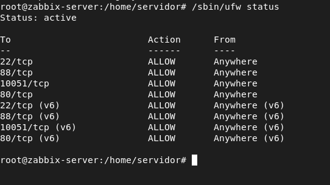
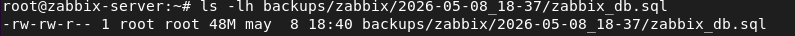
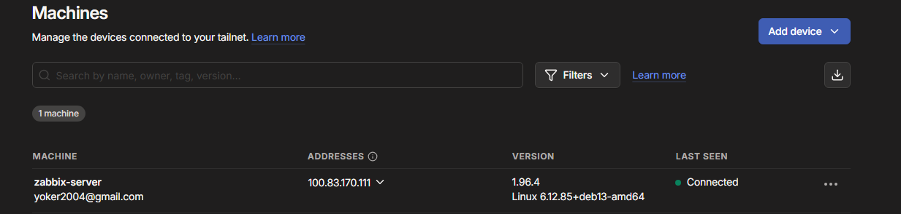

# Proyecto ASIR - Monitorización de red y servicios con Zabbix

<p align="center">
  
</p>

<p align="center">
  
  
  
  
  
</p>

---

## Índice

- [1. Introducción](#1-introducción)
- [2. Objetivos](#2-objetivos)
- [3. Arquitectura del proyecto](#3-arquitectura-del-proyecto)
- [4. Tecnologías utilizadas](#4-tecnologías-utilizadas)
- [5. Instalación del servidor Zabbix](#5-instalación-del-servidor-zabbix)
- [6. Configuración de clientes](#6-configuración-de-clientes)
- [7. Monitorización de servicios](#7-monitorización-de-servicios)
- [8. Alertas](#8-alertas)
- [9. Dashboards](#9-dashboards)
- [10. Seguridad](#10-seguridad)
- [11. Copias de seguridad](#11-copias-de-seguridad)
- [12. Acceso externo](#12-acceso-externo)
- [13. Pruebas realizadas](#13-pruebas-realizadas)
- [14. Problemas encontrados](#14-problemas-encontrados)
- [15. Mejoras futuras](#15-mejoras-futuras)
- [16. Conclusión](#16-conclusión)
- [17. Bibliografía](#17-bibliografía)

---

## 1. Introducción

<!--
Rellena aquí:
- De qué trata el proyecto.
- Por qué elegiste Zabbix.
- Qué problema quieres resolver.
- Qué aporta la monitorización en una red o sistema.
-->

---

## 2. Objetivos

### Objetivo principal

<!--
Rellena aquí el objetivo principal del proyecto.
-->

### Objetivos específicos

- [ ] <!-- Instalar y configurar el servidor Zabbix. -->
- [ ] <!-- Añadir clientes Linux y Windows. -->
- [ ] <!-- Monitorizar recursos del sistema. -->
- [ ] <!-- Monitorizar servicios críticos. -->
- [ ] <!-- Configurar alertas. -->
- [ ] <!-- Crear dashboards. -->
- [ ] <!-- Aplicar medidas de seguridad. -->
- [ ] <!-- Configurar copias de seguridad. -->
- [ ] <!-- Probar acceso externo seguro. -->

---

## 3. Arquitectura del proyecto

<!--
Rellena aquí una explicación general de la arquitectura.
-->

```text
PC principal / móvil
        |
        | Red local / Tailscale
        |
Servidor Zabbix - Debian 13
        |
        |--- Cliente Linux - Ubuntu Server
        |
        |--- Cliente Windows - Windows
```

### Equipos utilizados

| Equipo | Sistema operativo | IP local | Función |
|---|---|---:|---|
| `zabbix-server` | Debian 13 | `192.168.1.10` | Servidor Zabbix |
| `cliente-linux-01` | Ubuntu Server | `192.168.1.20` | Cliente Linux monitorizado |
| `windows-cliente-02` | Windows | `192.168.1.30` | Cliente Windows monitorizado |

<p align="center">
  
</p>

---

## 4. Tecnologías utilizadas

| Tecnología | Uso en el proyecto |
|---|---|
| Zabbix Server | <!-- Explica su función. --> |
| Zabbix Agent 2 | <!-- Explica su función. --> |
| Debian 13 | <!-- Explica por qué lo usas como servidor. --> |
| Ubuntu Server | <!-- Explica su uso como cliente Linux. --> |
| Windows | <!-- Explica su uso como cliente monitorizado. --> |
| MariaDB | <!-- Explica su función como base de datos. --> |
| Nginx | <!-- Explica su función como servidor web. --> |
| UFW / Firewall de Windows | <!-- Explica su función de seguridad. --> |
| Telegram / Email | <!-- Explica las alertas. --> |
| Tailscale | <!-- Explica el acceso externo. --> |
| Termius | <!-- Explica la conexión SSH desde móvil. --> |

---

## 5. Instalación del servidor Zabbix

<!--
Rellena aquí un resumen de la instalación del servidor.
Puedes enlazar al archivo detallado.
-->

📄 Documentación completa:

- [Configuración del servidor Zabbix](./zabbix/configuraciones/configuracion-servidor-zabbix.md)

### Componentes instalados

| Paquete | Función |
|---|---|
| `zabbix-server-mysql` | Servidor Zabbix con soporte MySQL/MariaDB |
| `zabbix-frontend-php` | Interfaz web de Zabbix |
| `zabbix-nginx-conf` | Configuración de Nginx para Zabbix |
| `zabbix-sql-scripts` | Scripts iniciales de la base de datos |
| `zabbix-agent2` | Agente moderno de Zabbix |
| `mariadb-server` | Base de datos |
| `nginx` | Servidor web |

<p align="center">
  
</p>

---

## 6. Configuración de clientes

<!--
Rellena aquí un resumen de cómo añadiste los clientes.
-->

### Cliente Linux

📄 Documentación completa:

- [Configuración del cliente Linux](./zabbix/configuraciones/configuracion-basica-clientes-linux.md)

<p align="center">
  
</p>

### Cliente Windows

📄 Documentación completa:

- [Configuración del cliente Windows](./zabbix/configuraciones/configuracion-basica-cliente-windows.md)

<p align="center">
  
</p>

---

## 7. Monitorización de servicios

<!--
Rellena aquí qué servicios se monitorizan y por qué son importantes.
-->

📄 Documentación completa:

- [Monitorización de servicios](./zabbix/configuraciones/monitorizacion.md)

### Servicios monitorizados

| Servicio | Equipo | Métrica / clave | Objetivo |
|---|---|---|---|
| Ping | Todos | `icmpping` | Comprobar disponibilidad |
| SSH | `cliente-linux-01` | `net.tcp.service[ssh]` | Comprobar acceso remoto |
| HTTP | `cliente-linux-01` | `net.tcp.service[http]` | Comprobar servicio web |
| Web scenario | `cliente-linux-01` | `web.test.fail[...]` | Comprobar respuesta HTTP |
| MariaDB | `zabbix-server` | `net.tcp.service[tcp,,3306]` | Comprobar base de datos |
| Agente Zabbix | Linux/Windows | `agent.ping` | Comprobar agente |
| CPU | Linux/Windows | `system.cpu.util[...]` | Medir carga |
| RAM | Linux/Windows | `vm.memory.size[...]` | Medir memoria |
| Disco | Linux/Windows | `vfs.fs.size[...]` | Medir almacenamiento |

<p align="center">
  
</p>

<p align="center">
  
</p>

---

## 8. Alertas

<!--
Rellena aquí cómo configuraste las alertas y qué canales usaste.
No pongas tokens, contraseñas ni chat IDs reales.
-->

📄 Documentación completa:

- [Configuración de alertas](./zabbix/configuraciones/configuraralertas.md)

### Flujo de alertas

```text
Métrica → Iniciador → Problema → Acción → Medio de aviso → Usuario
```

### Medios configurados

| Medio | Estado | Uso |
|---|---|---|
| Telegram | <!-- Configurado / Pendiente --> | Avisos al móvil |
| Correo electrónico | <!-- Configurado / Pendiente --> | Avisos por SMTP |

<p align="center">
  
</p>

---

## 9. Dashboards

<!--
Rellena aquí qué dashboards creaste y qué muestra cada uno.
-->

📄 Documentación completa:

- [Dashboards](./zabbix/configuraciones/dashboards.md)

### Dashboards creados

| Dashboard | Contenido |
|---|---|
| Monitorización general ASIR | <!-- Problemas, disponibilidad, servicios, web, valores destacados. --> |
| Recursos de sistemas ASIR | <!-- CPU, RAM, disco, red y recursos principales. --> |

<p align="center">
  
</p>

<p align="center">
  
</p>

---

## 10. Seguridad

<!--
Rellena aquí las medidas de seguridad aplicadas.
-->

📄 Documentación completa:

- [Seguridad del servidor Zabbix](./zabbix/configuraciones/seguridad.md)

### Medidas aplicadas

| Medida | Estado |
|---|---|
| Cambio de contraseña de Admin | <!-- Hecho / Pendiente --> |
| Revisión de usuario guest | <!-- Hecho / Pendiente --> |
| Usuario administrador propio | <!-- Hecho / Pendiente --> |
| Firewall UFW | <!-- Hecho / Pendiente --> |
| Firewall Windows | <!-- Hecho / Pendiente --> |
| HTTPS con certificado autofirmado | <!-- Hecho / Pendiente --> |
| Backups | <!-- Hecho / Pendiente --> |
| Acceso externo por Tailscale | <!-- Hecho / Pendiente --> |

<p align="center">
  
</p>

---

## 11. Copias de seguridad

<!--
Rellena aquí cómo realizaste los backups.
-->

### Elementos respaldados

- [ ] <!-- Base de datos Zabbix -->
- [ ] <!-- Configuración de Zabbix -->
- [ ] <!-- Configuración de Nginx -->
- [ ] <!-- Configuración PHP -->
- [ ] <!-- Repositorios -->
- [ ] <!-- Scripts de alertas -->

<p align="center">
  
</p>

---

## 12. Acceso externo

<!--
Rellena aquí cómo configuraste el acceso externo con Tailscale y Termius.
-->

📄 Documentación completa:

- [Acceso externo con Tailscale](./zabbix/configuraciones/entrada-romota.md)

```text
PC o móvil fuera de casa
        |
     Tailscale
        |
Servidor Zabbix Debian 13
        |
https://IP_TAILSCALE_DEL_SERVIDOR
```

<p align="center">
  
</p>

---

## 13. Pruebas realizadas

<!--
Rellena aquí los resultados reales de las pruebas.
-->

| Prueba | Equipo | Acción realizada | Resultado esperado | Resultado obtenido |
|---|---|---|---|---|
| Ping caído | `cliente-linux-01` | <!-- Acción --> | <!-- Resultado esperado --> | <!-- Resultado obtenido --> |
| SSH caído | `cliente-linux-01` | `sudo systemctl stop ssh` | <!-- Resultado esperado --> | <!-- Resultado obtenido --> |
| HTTP caído | `cliente-linux-01` | `sudo systemctl stop nginx` | <!-- Resultado esperado --> | <!-- Resultado obtenido --> |
| Escenario web caído | `cliente-linux-01` | `sudo systemctl stop nginx` | <!-- Resultado esperado --> | <!-- Resultado obtenido --> |
| Agente Linux caído | `cliente-linux-01` | `sudo systemctl stop zabbix-agent2` | <!-- Resultado esperado --> | <!-- Resultado obtenido --> |
| Agente Windows caído | `windows-cliente-02` | `Stop-Service "Zabbix Agent 2"` | <!-- Resultado esperado --> | <!-- Resultado obtenido --> |
| MariaDB caída | `zabbix-server` | `systemctl stop mariadb` | <!-- Resultado esperado --> | <!-- Resultado obtenido --> |
| CPU alta | `cliente-linux-01` | `stress-ng --cpu 2 --timeout 120s` | <!-- Resultado esperado --> | <!-- Resultado obtenido --> |
| Disco ocupado | `cliente-linux-01` | `fallocate -l 1G prueba_disco.img` | <!-- Resultado esperado --> | <!-- Resultado obtenido --> |

---

## 14. Problemas encontrados

<!--
Rellena aquí errores reales que hayas tenido durante el proyecto y cómo los solucionaste.
-->

| Problema | Causa | Solución |
|---|---|---|
| <!-- Error --> | <!-- Causa --> | <!-- Solución --> |
| <!-- Error --> | <!-- Causa --> | <!-- Solución --> |
| <!-- Error --> | <!-- Causa --> | <!-- Solución --> |

---

## 15. Mejoras futuras

<!--
Rellena aquí posibles ampliaciones.
-->

- [ ] <!-- Cifrado PSK entre servidor y agentes. -->
- [ ] <!-- Monitorización avanzada de MariaDB. -->
- [ ] <!-- Certificado válido con dominio y Let's Encrypt. -->
- [ ] <!-- Integración con IA para análisis de alertas. -->
- [ ] <!-- Más clientes o servicios monitorizados. -->
- [ ] <!-- Automatización de backups con cron. -->

---

## 16. Conclusión

<!--
Rellena aquí una conclusión final del proyecto.
Explica qué has conseguido, qué has aprendido y qué utilidad tiene.
-->

---

## 17. Bibliografía

<!--
Añade aquí fuentes utilizadas.
-->

- Documentación oficial de Zabbix: https://www.zabbix.com/documentation/current/
- Descarga de Zabbix: https://www.zabbix.com/download
- Zabbix Agents: https://www.zabbix.com/download_agents
- Debian: https://www.debian.org/doc/
- Nginx: https://nginx.org/en/docs/
- MariaDB: https://mariadb.com/kb/en/documentation/
- Tailscale: https://tailscale.com/docs

---

## Autor

<!--
Rellena aquí tu nombre, ciclo y curso.
-->

```text
Nombre:
Ciclo:
Centro:
Curso:
```
