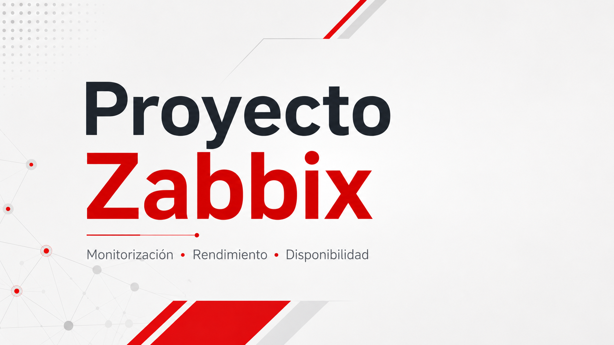
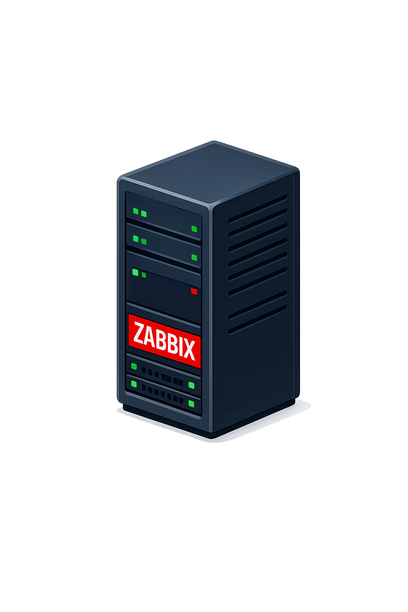
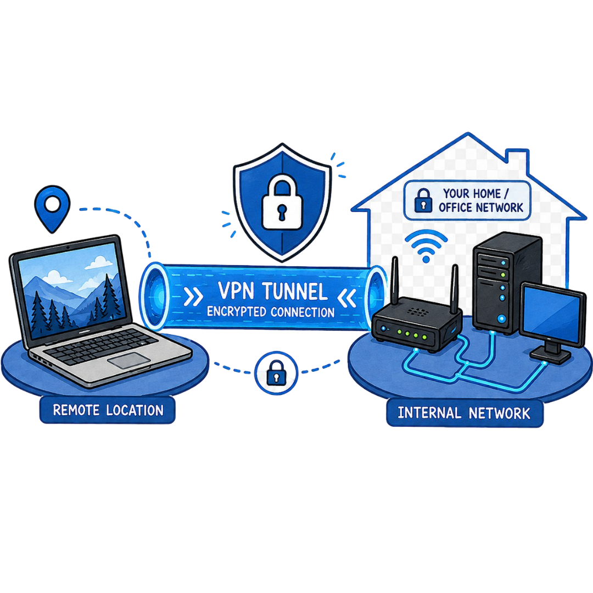

# Proyecto ASIR - Monitorización de red y servicios con Zabbix

<p align="center">
  
</p>

<p align="center">
  
  
  
  
  
</p>

---

## Índice

- [1. Introducción](#1-introducción)
- [2. Objetivos](#2-objetivos)
- [3. Arquitectura del proyecto](#3-arquitectura-del-proyecto)
- [4. Tecnologías utilizadas](#4-tecnologías-utilizadas)
- [5. Instalación del servidor Zabbix](#5-instalación-del-servidor-zabbix)
- [6. Configuración de clientes](#6-configuración-de-clientes)
- [7. Monitorización de servicios](#7-monitorización-de-servicios)
- [8. Alertas](#8-alertas)
- [9. Dashboards](#9-dashboards)
- [10. Seguridad](#10-seguridad)
- [11. Copias de seguridad](#11-copias-de-seguridad)
- [12. Acceso externo](#12-acceso-externo)
- [13. Pruebas realizadas](#13-pruebas-realizadas)
- [14. Problemas encontrados](#14-problemas-encontrados)
- [15. Mejoras futuras](#15-mejoras-futuras)
- [16. Conclusión](#16-conclusión)
- [17. Bibliografía](#17-bibliografía)

---

## 1. Introducción

Este proyecto consiste en aprender, instalar y configurar Zabbix en un entorno simulado mediante máquinas virtuales. La finalidad es crear un sistema de monitorización centralizado que permita supervisar diferentes equipos y servicios, comprobar su estado y detectar posibles fallos.

Elegí Zabbix porque me pareció una herramienta muy completa y útil para la monitorización de servidores, servicios y equipos dentro de una red. Además, cuenta con bastante documentación, una comunidad amplia y muchas posibilidades de configuración, lo que la convierte en una buena opción.

La monitorización aporta mucho valor en una red o sistema, ya que ayuda a detectar incidencias rápidamente, recibir alertas cuando algo falla y consultar gráficas. Esto facilita la administración de los equipos.

Además, este proyecto también me sirve como aprendizaje personal, ya que en el futuro me gustaría aplicar Zabbix a un mini servidor que estoy montando en casa.

---

## 2. Objetivos

### Objetivo principal


el objetivo principal es montar un entorno monitorizado por zabbix con pruebas reales


### Objetivos específicos

- [Instalar y configurar el servidor Zabbix.]  
- [Añadir clientes Linux y Windows.]  
- [Monitorizar recursos del sistema.]
- [Monitorizar servicios críticos.]  
- [Configurar alertas.]  
- [Crear dashboards. ]
- [Aplicar medidas de seguridad]
- [Configurar copias de seguridad.]  
- [Probar acceso externo seguro.] 
---

## 3. Arquitectura del proyecto

quise hacer una arquitectura sencilla ademas de que no puedo ampliarla mucho mas debido a las limitaciones de mi hardware

```text
PC principal / móvil
        |
        | Red local / Tailscale
        |
Servidor Zabbix - Debian 13
        |
        |--- Cliente Linux - Ubuntu Server
        |
        |--- Cliente Windows - Windows
```

### Equipos utilizados

| Equipo | Sistema operativo | IP local | Función |
|---|---|---:|---|
| `zabbix-server` | Debian 13 | `192.168.1.10` | Servidor Zabbix |
| `cliente-linux-01` | Ubuntu Server | `192.168.1.20` | Cliente Linux monitorizado |
| `windows-cliente-02` | Windows | `192.168.1.30` | Cliente Windows monitorizado |

<p align="center">
  
</p>

---

## 4. Tecnologías utilizadas

| Tecnología | Uso en el proyecto |
|---|---|
| Zabbix Server | Es el componente principal del proyecto. Recoge la información de los equipos monitorizados permite gestionar la monitorización desde la interfaz web. |
| Zabbix Agent 2 | Se instala en los clientes para enviar al servidor datos del sistema. |
| Debian 13 |lo elegi por su estabilidad, compatibilidad con Zabbix y disponibilidad de paquetes actualizados. |
| Ubuntu Server |  cliente monitorizado. |
| Windows | Equipo cliente monitorizado. |
| MariaDB | Base de datos donde Zabbix guarda la configuración, los hosts, las métricas recogidas, los eventos, los problemas y el historial de monitorización. |
| Nginx | Servidor web para la interfaz web de Zabbix, desde la que se administra el sistema de monitorización. |
| UFW / Firewall de Windows | permitiendo solo los puertos necesarios para Zabbix, SSH, HTTP/HTTPS y los agentes. |
| Telegram / Email | seran los medios por los que enviare las alertas . |
| Tailscale | Servicio VPN utilizado para acceder de forma segura al servidor Zabbix desde fuera de la red local sin abrir puertos directamente en el router. |
| Termius | Aplicación utilizada para conectarse por SSH al servidor desde el móvil y poder realizar tareas de administración remota. |

---

## 5. Instalación del servidor Zabbix

📄 Documentación completa:

- [Configuración del servidor Zabbix](./zabbix/configuraciones/configuracion-servidor-zabbix.md)

### Componentes instalados

| Paquete | Función |
|---|---|
| `zabbix-server-mysql` | Servidor Zabbix con soporte MySQL/MariaDB |
| `zabbix-frontend-php` | Interfaz web de Zabbix |
| `zabbix-nginx-conf` | Configuración de Nginx para Zabbix |
| `zabbix-sql-scripts` | Scripts iniciales de la base de datos |
| `zabbix-agent2` | Agente moderno de Zabbix |
| `mariadb-server` | Base de datos |
| `nginx` | Servidor web |


<p align="center">
  
</p>

---

## 6. Configuración de clientes

<!--
Rellena aquí un resumen de cómo añadiste los clientes.
-->

### Cliente Linux

📄 Documentación completa:

- [Configuración del cliente Linux](./zabbix/configuraciones/configuracion-basica-clientes-linux.md)

<p align="center">
  
</p>
### Cliente Windows

📄 Documentación completa:

- [Configuración del cliente Windows](./zabbix/configuraciones/configuracion-basica-cliente-windows.md)

<p align="center">
  
</p>
---

## 7. Monitorización de servicios


📄 Documentación completa:

- [Monitorización de servicios](./zabbix/configuraciones/monitorizacion.md)

### Servicios monitorizados

| Servicio | Equipo | Métrica / clave | Objetivo |
|---|---|---|---|
| Ping | Todos | `icmpping` | Comprobar disponibilidad |
| SSH | `cliente-linux-01` | `net.tcp.service[ssh]` | Comprobar acceso remoto |
| HTTP | `cliente-linux-01` | `net.tcp.service[http]` | Comprobar servicio web |
| Web scenario | `cliente-linux-01` | `web.test.fail[...]` | Comprobar respuesta HTTP |
| MariaDB | `zabbix-server` | `net.tcp.service[tcp,,3306]` | Comprobar base de datos |
| Agente Zabbix | Linux/Windows | `agent.ping` | Comprobar agente |
| CPU | Linux/Windows | `system.cpu.util[...]` | Medir carga |
| RAM | Linux/Windows | `vm.memory.size[...]` | Medir memoria |
| Disco | Linux/Windows | `vfs.fs.size[...]` | Medir almacenamiento |

---

## 8. Alertas

<!--
Rellena aquí cómo configuraste las alertas y qué canales usaste.
No pongas tokens, contraseñas ni chat IDs reales.
-->

📄 Documentación completa:

- [Configuración de alertas](./zabbix/configuraciones/configuraralertas.md)

### Flujo de alertas

```text
Métrica → Iniciador → Problema → Acción → Medio de aviso → Usuario
```

<p align="center">
  
</p>


### Medios configurados

| Medio | Estado | Uso |
|---|---|---|
| Telegram | <!-- Configurado / Pendiente --> | Avisos al móvil |
| Correo electrónico | <!-- Configurado / Pendiente --> | Avisos por SMTP |


---

## 9. Dashboards


📄 Documentación completa:

- [Dashboards](./zabbix/configuraciones/dashboards.md)

### Dashboards creados

| Dashboard | Contenido |
|---|---|
| Monitorización general ASIR |  Problemas, disponibilidad, servicios, web, valores destacados.  |
| Recursos de sistemas ASIR | CPU, RAM, disco, red y recursos principales.|

<p align="center">
  
</p>

<p align="center">
  
</p>

---

## 10. Seguridad

las medidas aplicadas en este apartado son muy basicas pero realmente para lo que buscamos es perfecto
📄 Documentación completa:

- [Seguridad del servidor Zabbix](./zabbix/configuraciones/seguridad.md)

### Medidas aplicadas

| Medida | Estado |
|---|---|
| Cambio de contraseña de Admin | Hecho |
| Revisión de usuario guest |  Hecho  |
| Usuario administrador propio |  Hecho |
| Firewall UFW | Hecho  |
| Firewall Windows |  Hecho  |
| HTTPS con certificado autofirmado |  Hecho  |
| Backups |Hecho |
| Acceso externo por Tailscale | Hecho  |

<p align="center">
  
</p>

---

## 11. Copias de seguridad

los elementos mas importantes a respaldar:

- [ Base de datos Zabbix ] 
- [Configuración de Zabbix ] 
- [ Configuración de Nginx] 
- [Configuración PHP ] 
- [ Repositorios] 
- [ Scripts de alertas] 

---

## 12. Acceso externo


📄 Documentación completa:

- [Acceso externo con Tailscale](./zabbix/configuraciones/entrada-romota.md)

```text
PC o móvil fuera de casa
        |
     Tailscale
        |
Servidor Zabbix Debian 13
        |
https://IP_TAILSCALE_DEL_SERVIDOR
```

<p align="center">
  
</p>

---

## 13. Pruebas realizadas


| Prueba | Equipo | Acción realizada | Resultado esperado | Resultado obtenido |
|---|---|---|---|---|
| Ping caído | `cliente-linux-01` | <!-- Acción --> | <!-- Resultado esperado --> | <!-- Resultado obtenido --> |
| SSH caído | `cliente-linux-01` | `sudo systemctl stop ssh` | <!-- Resultado esperado --> | <!-- Resultado obtenido --> |
| HTTP caído | `cliente-linux-01` | `sudo systemctl stop nginx` | <!-- Resultado esperado --> | <!-- Resultado obtenido --> |
| Escenario web caído | `cliente-linux-01` | `sudo systemctl stop nginx` | <!-- Resultado esperado --> | <!-- Resultado obtenido --> |
| Agente Linux caído | `cliente-linux-01` | `sudo systemctl stop zabbix-agent2` | <!-- Resultado esperado --> | <!-- Resultado obtenido --> |
| Agente Windows caído | `windows-cliente-02` | `Stop-Service "Zabbix Agent 2"` | <!-- Resultado esperado --> | <!-- Resultado obtenido --> |
| MariaDB caída | `zabbix-server` | `systemctl stop mariadb` | <!-- Resultado esperado --> | <!-- Resultado obtenido --> |
| CPU alta | `cliente-linux-01` | `stress-ng --cpu 2 --timeout 120s` | <!-- Resultado esperado --> | <!-- Resultado obtenido --> |
| Disco ocupado | `cliente-linux-01` | `fallocate -l 1G prueba_disco.img` | <!-- Resultado esperado --> | <!-- Resultado obtenido --> |

---

## 14. Problemas encontrados

<!--
Rellena aquí errores reales que hayas tenido durante el proyecto y cómo los solucionaste.
-->

| Problema | Causa | Solución |
|---|---|---|
| <!-- Error --> | <!-- Causa --> | <!-- Solución --> |
| <!-- Error --> | <!-- Causa --> | <!-- Solución --> |
| <!-- Error --> | <!-- Causa --> | <!-- Solución --> |

---

## 15. Mejoras futuras

- [Configurar cifrado PSK entre el servidor y los agentes para mejorar la seguridad. ] 
- [ Añadir monitorización avanzada de MariaDB para revisar rendimiento, conexiones y consultas. ]
- [Usar un certificado válido con dominio y Let's Encrypt para acceder por HTTPS. ] 
- [Probar una integración con IA para ayudar a analizar alertas y posibles causas.] 
- [ Añadir más clientes o servicios monitorizados para ampliar las pruebas. ]
- [Automatizar las copias de seguridad con cron para hacerlas de forma periódica. ] 

---

## 16. Conclusión

<!--
Rellena aquí una conclusión final del proyecto.
Explica qué has conseguido, qué has aprendido y qué utilidad tiene.
-->

---

## 17. Bibliografía


- Documentación oficial de Zabbix: https://www.zabbix.com/documentation/current/
- Descarga de Zabbix: https://www.zabbix.com/download
- Zabbix Agents: https://www.zabbix.com/download_agents
- Debian: https://www.debian.org/doc/
- Nginx: https://nginx.org/en/docs/
- MariaDB: https://mariadb.com/kb/en/documentation/
- Tailscale: https://tailscale.com/docs

---

## Autor

```text
Ildefonso
Estudiante de ASIR en el IES Rodrigo Caro
```
