# Configuración del cliente Windows en Zabbix

En este apartado se configura una máquina Windows como cliente monitorizado por Zabbix. Para ello se configura una IP estática, se instala **Zabbix Agent 2**, se permite el puerto necesario en el Firewall de Windows y se añade el equipo al servidor Zabbix.

el cliente Windows se identificará como:

```text
windows-cliente-02
```

Datos usados en el laboratorio:

```text
Servidor Zabbix: 192.168.1.10
Cliente Windows: 192.168.1.30
Puerto del agente: 10050/tcp
```

---

## 1. Configuración inicial de red

 IP estática en el cliente Windows para que el servidor Zabbix pueda localizar siempre la máquina con la misma dirección.


```text
Dirección IP: 192.168.1.30
Máscara: 255.255.255.0
Puerta de enlace: 192.168.1.1
DNS: 192.168.1.1 / 8.8.8.8
```

Para comprobar la configuración IP desde Windows se puede abrir PowerShell o CMD y ejecutar:

```powershell
ipconfig
```

Este comando muestra la configuración de red del equipo, incluyendo la dirección IPv4, máscara, puerta de enlace y servidores DNS.

También se comprueba que el cliente Windows puede comunicarse con el servidor Zabbix:

```powershell
ping 192.168.1.10
```

Desde el servidor Zabbix también se puede comprobar la conexión hacia Windows:

```bash
ping -c 4 192.168.1.30
```

---

## 2. Descarga de Zabbix Agent 2

Vamos a la página oficial de **Zabbix Agents**:

[Descargar Zabbix Agents](https://www.zabbix.com/download_agents)

En la página de descargas se selecciona **Zabbix Agent 2** para Windows en versión MSI de 64 bits.

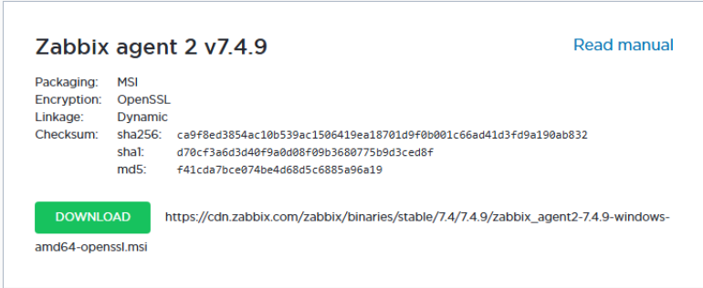

Nos aseguramos de seleccionar la versión adecuada para Windows:

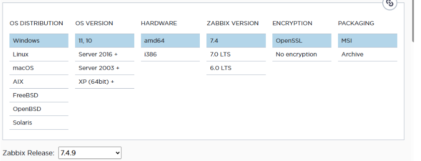

---

## 3. Instalación del agente 

Iniciamos el ejecutable MSI como administrador:

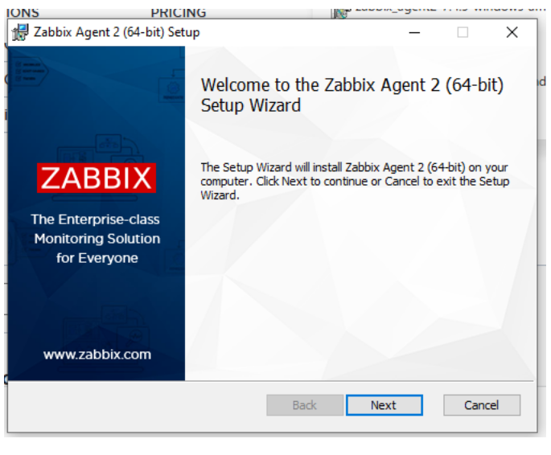

Durante la instalación se introducen los datos del servidor Zabbix y el nombre del host.

Configuración usada:

```text
Host name: windows-cliente-02
Zabbix server IP/DNS: 192.168.1.10
Server or Proxy for active checks: 192.168.1.10
Listen port: 10050
```

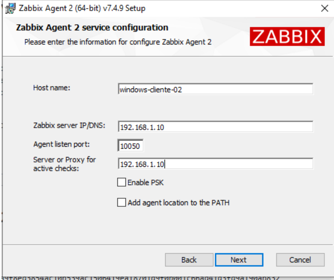

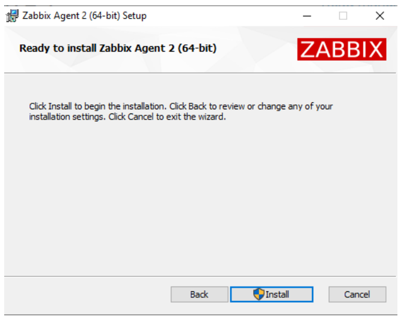

Durante la instalación se acepta la creación del servicio de **Zabbix Agent 2**:

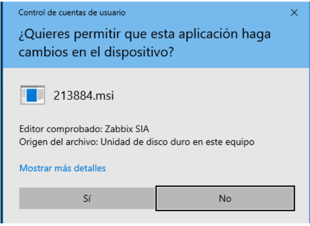

---

## 4. Comprobación del servicio

Una vez instalado el agente, comprobamos que el servicio está activo.

Desde la interfaz gráfica podemos abrir:

```text
Win + R → services.msc
```

Y buscar:

```text
Zabbix Agent 2
```

Debe aparecer en ejecución:

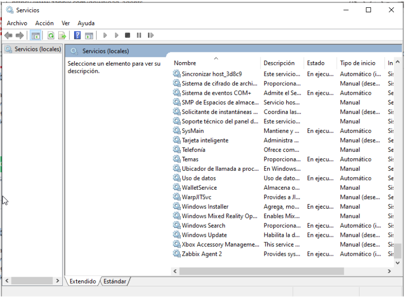

También se puede comprobar desde PowerShell como administrador:

```powershell
Get-Service "Zabbix Agent 2"
```
 
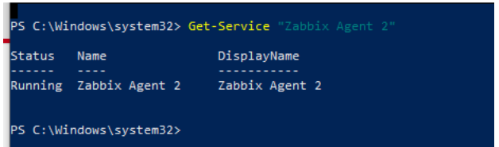

Si aparece `Running`, significa que el agente está activo.

Si el servicio estuviera parado, se puede iniciar con:

```powershell
Start-Service "Zabbix Agent 2"
```

---

## 5. Revisión del archivo de configuración

Para asegurarnos de que el agente está configurado correctamente, podemos revisar el archivo:

```text
C:\Program Files\Zabbix Agent 2\zabbix_agent2.conf
```

En ese archivo deben aparecer valores similares a estos:

```text
Server=192.168.1.10
ServerActive=192.168.1.10
Hostname=windows-cliente-02
```

Significado de cada parámetro:

| Parámetro | Función |
|---|---|
| `Server` | Indica qué servidor Zabbix puede consultar al agente. |
| `ServerActive` | Indica a qué servidor enviará el agente las comprobaciones activas. |
| `Hostname` | Nombre del host. Debe coincidir exactamente con el nombre configurado en Zabbix. |

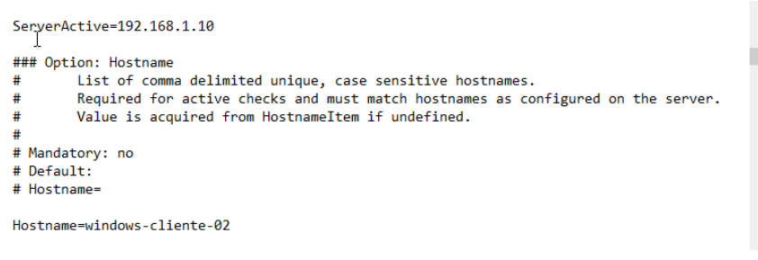

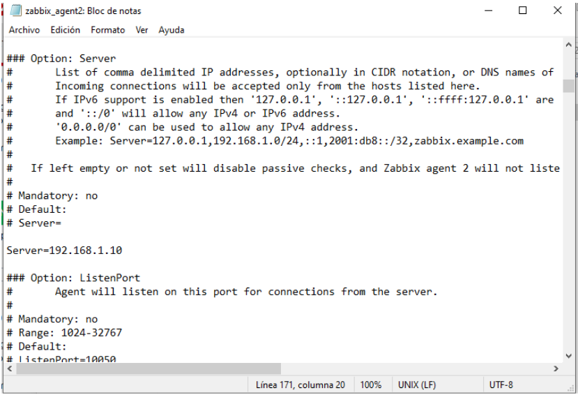

Si decidimos modificar este archivo, hay que reiniciar el servicio:

```powershell
Restart-Service "Zabbix Agent 2"
```

---

## 6. Configuración del Firewall de Windows

de normal yo desactivaria por completo el Firewall de Windows para ahorrarme tiemp. Pero lo correcto es crear una regla específica para permitir el puerto usado por Zabbix Agent 2.

Abrimos PowerShell como administrador y ejecutamos:

```powershell
New-NetFirewallRule -DisplayName "Zabbix Agent 2" -Direction Inbound -Protocol TCP -LocalPort 10050 -Action Allow
```

Este comando crea una regla de entrada en el Firewall de Windows para permitir conexiones TCP al puerto `10050`.

Para comprobar que la regla existe:

```powershell
Get-NetFirewallRule -DisplayName "Zabbix Agent 2"
```

---

## 7. Comprobación desde el servidor Zabbix

Desde el servidor Zabbix podemos comprobar que el agente de Windows responde usando `zabbix_get`.

Comprobamos el agente de Windows:

```bash
zabbix_get -s 192.168.1.30 -k agent.ping
```

Resultado correcto:

```text
1
```

Si devuelve `1`, significa que el servidor Zabbix puede comunicarse correctamente con el agente Windows.

También podemos comprobar el nombre del sistema:

```bash
zabbix_get -s 192.168.1.30 -k system.hostname
```

Este comando devuelve el nombre del sistema configurado en el agente, útil para comprobar que el host está bien identificado.

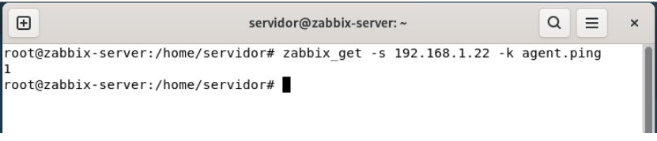

---

## 8. Configuración en la web de Zabbix

Una vez comprobado que el agente responde, añadimos el equipo Windows en la interfaz web de Zabbix.

Ruta:

```text
Recopilación de datos → Equipos → Crear equipo
```

Configuración del equipo:

```text
Nombre de equipo: windows-cliente-02
Nombre visible: windows-cliente-02
Grupo: Windows servers / Máquinas virtuales
Plantilla: Windows by Zabbix agent
```

Configuración de la interfaz:

```text
Tipo: Agente
Dirección IP: 192.168.1.30
Nombre DNS: vacío
Conectar a: IP
Puerto: 10050
```

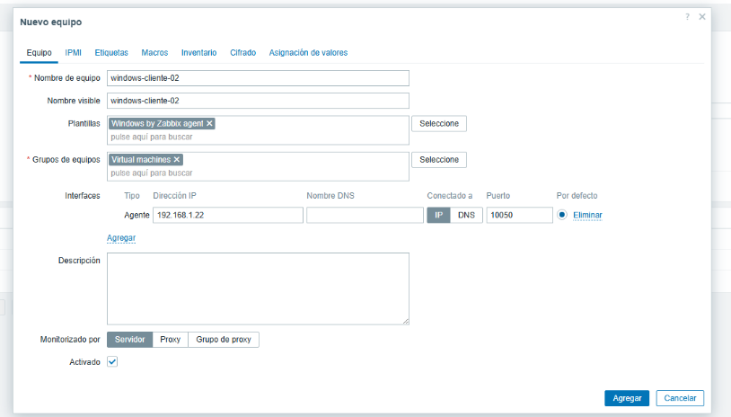

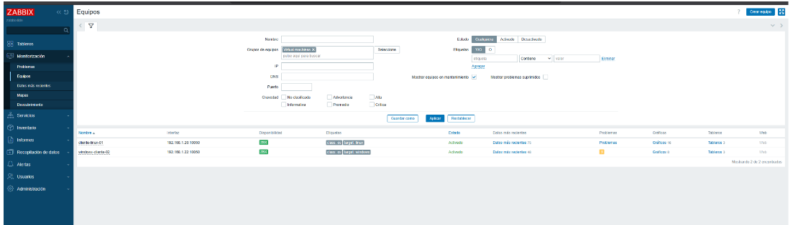

---

## 9. Comprobación en Zabbix

Después de crear el host, vamos a:

```text
Recopilación de datos → Equipos
```

El icono **ZBX** del equipo Windows debería aparecer en verde. Esto indica que el servidor Zabbix puede comunicarse correctamente con el agente.

Después vamos a:

```text
Monitorización → Datos más recientes
```

Filtramos por:

```text
windows-cliente-02
```

Deberíamos ver métricas como:

```text
CPU utilization
Memory utilization
C: Space utilization
Network traffic
System uptime
```

---

## 10. Prueba real

como hicimos con el cliente linux

Para comprobar que Zabbix detecta la caída del agente, se detiene temporalmente el servicio desde PowerShell como administrador:

```powershell
Stop-Service "Zabbix Agent 2"
```


Tras unos minutos, Zabbix dejará de recibir datos del cliente Windows y aparecerá el problema correspondiente, si existe un iniciador configurado para detectar la falta de datos del agente.

Después se vuelve a iniciar el servicio:

```powershell
Start-Service "Zabbix Agent 2"
```

Al recuperarse el agente, Zabbix vuelve a recibir métricas correctamente y el problema se resuelve automáticamente.

---

## Resumen

Con esta configuración, el cliente Windows queda integrado en el sistema de monitorización Zabbix. El servidor puede consultar el agente mediante el puerto `10050/tcp` y recibir métricas del sistema como CPU, memoria, disco, red y tiempo de actividad.

Además, se comprobó el funcionamiento del agente mediante `zabbix_get` y se realizó una prueba real deteniendo temporalmente el servicio **Zabbix Agent 2**.
