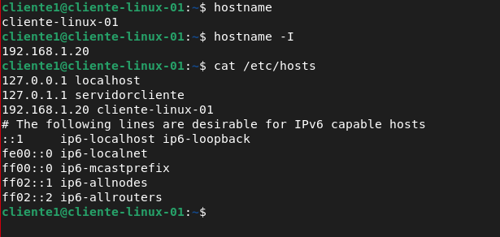
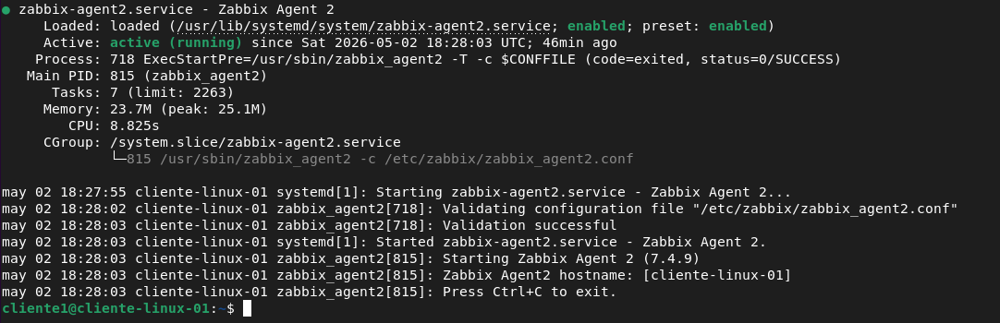
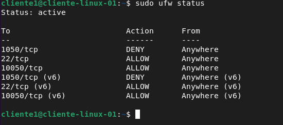
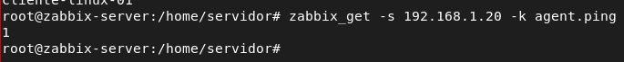
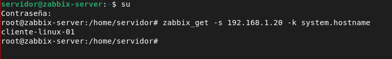
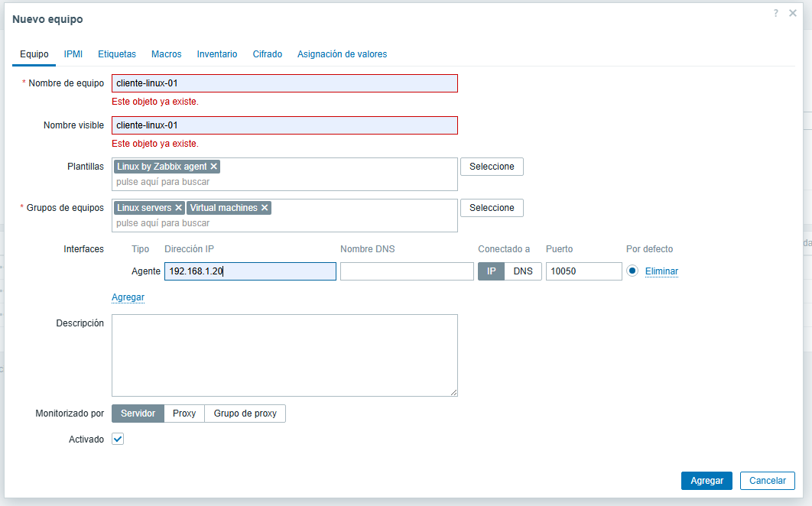
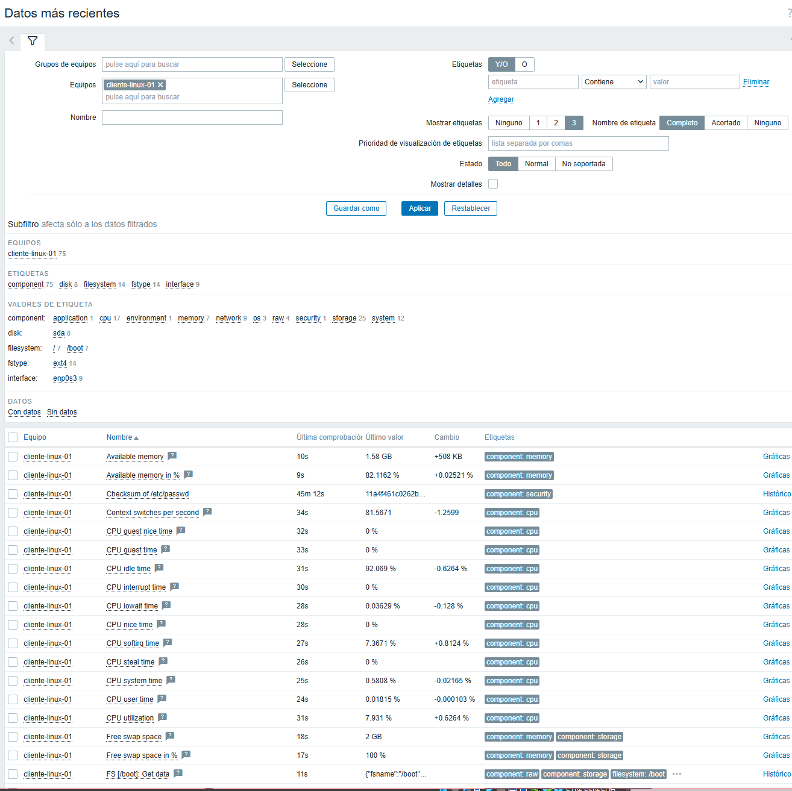
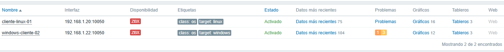

lo principal sera configurar su ip 

en ubuntu server utilizan netplan asi que modificaremos este archivo 50-cloud-init.yaml

en caso de aparecer otro pues modificas ese que hay

ls /etc/netplan/

sudo nano /etc/netplan/50-cloud-init.yaml


y la configuracion debe ser algo asi

network:
  version: 2
  renderer: networkd
  ethernets:
    enp0s3:
      dhcp4: false
      addresses:
        - 192.168.1.20/24
      routes:
        - to: default
          via: 192.168.1.1
      nameservers:
        addresses:
          - 192.168.1.1
          - 8.8.8.8

en yaml ten cuidado con los espacios y las tabulaciones 

ahora aplicaremos aunque con un reboot tambien se puede

sudo netplan try


sudo netplan apply

una vez configurada actualizar y empezar a instalar paquetes

a parte de la ip debemos cambiar el hostname y los hosts

```bash
sudo hostnamectl set-hostname cliente-linux-01
```

```bash
sudo nano /etc/hosts
```

Añade algo parecido:

```text
192.168.1.20 cliente-linux-01
```

Comprobamos:

```bash
hostname
hostname -I
```



---

yo partir de aqui lo hice conectado por ssh ya que me era mas comodo pero ya eso depende de ti

# instalar repositorio de Zabbix en el cliente Linux

En el cliente Linux, primero comprueba qué sistema tienes:

```bash
cat /etc/os-release
```

Si tu version es la misma que la mia que es **Ubuntu 24.04**, usa:

```bash
wget https://repo.zabbix.com/zabbix/7.4/release/ubuntu/pool/main/z/zabbix-release/zabbix-release_latest_7.4+ubuntu24.04_all.deb
sudo dpkg -i zabbix-release_latest_7.4+ubuntu24.04_all.deb
sudo apt update
```

Si decidiste hacer un cliente debian **Debian 13**, usa:

```bash
wget https://repo.zabbix.com/zabbix/7.4/release/debian/pool/main/z/zabbix-release/zabbix-release_latest_7.4+debian13_all.deb
sudo dpkg -i zabbix-release_latest_7.4+debian13_all.deb
sudo apt update
```

---

# instalar Zabbix Agent 2 en el cliente

En el cliente:

```bash
sudo apt install -y zabbix-agent2
```

Activa el servicio:

```bash
sudo systemctl enable --now zabbix-agent2
sudo systemctl status zabbix-agent2
```



---

# configurar el agente del cliente

Edita:

```bash
sudo nano /etc/zabbix/zabbix_agent2.conf
```

Busca estas líneas y cambia las ip por las del servidor zabbix

```text
Server=192.168.1.10
ServerActive=192.168.1.10
Hostname=cliente-linux-01
```

Importante: `Hostname` tiene que coincidir exactamente con el nombre que luego pondremos en Zabbix.

Reinicia el agente:

```bash
sudo systemctl restart zabbix-agent2
sudo systemctl status zabbix-agent2
```

---

# abrir firewall en el cliente Linux

yo no tuve que instalar el ufw en ubuntu-server

```bash
sudo ufw status
```

Permite el puerto del agente:

```bash
sudo ufw allow 10050/tcp
sudo ufw reload
```
El puerto `10050/tcp` es el puerto por defecto del agente Zabbix.

y ademas el 22 para el ssh en mi caso al menos

```bash
sudo ufw allow 22/tcp
```



---

# comprobar desde el servidor que el agente responde

En el servidor Zabbix instala la herramienta `zabbix-get`:

```bash
apt install -y zabbix-get
```

Desde el servidor, prueba:

```bash
zabbix_get -s IP_DEL_CLIENTE -k agent.ping
```


Resultado correcto: 1



También puedes probar:

```bash
zabbix_get -s 192.168.1.20 -k system.hostname
```




---

# crear el host en Zabbix Web


Ve a:

```text
recopilacion de datos → equipos → crear equipos
```

Rellena:

```text
nombre de equipo : cliente-linux-01
nombre: cliente-linux-01
la plantilla recomendada por ahora es la de linux by zabbix agent
el grupo lo meteremos en linux servers y ademas en maquinas virtuales 
```

```text
interfaces → agregar 
```


```text
Type: Agent
IP address: 192.168.1.20 (ip del cliente)
DNS name: vacío
Connect to: IP
Port: 10050
```
en plantillas:

```text
Linux by Zabbix agent
```



---

# comprobar que funciona

El icono **ZBX** del cliente debería ponerse verde.


Después ve a:

```text
Monitoring → Latest data
```

Filtra por:

```text
cliente-linux-01
```




---

# prueba real para la memoria

En el cliente Linux ejecuta:

```bash
sudo systemctl stop zabbix-agent2
```

Espera unos minutos y revisa en Zabbix si aparece problema de agente no disponible o falta de datos.



Después vuelve a levantarlo:

```bash
sudo systemctl start zabbix-agent2
```

También puedes generar carga de CPU instalando `stress-ng`:

```bash
sudo apt install -y stress-ng
stress-ng --cpu 2 --timeout 60s
```


