# Configuración del servidor Zabbix

Empezaremos con la configuración de la IP siguiendo la estructura que ideamos:

> Enlace al documento con la organización

---

## 1. Actualización del sistema

Lo primero es hacer una actualización:

```bash
apt update
```

La opción `-y` es para que acepte automáticamente:

```bash
apt upgrade -y
```

---

## 2. Configuración de IP fija

Ya actualizado, configuramos la IP en este archivo:

```bash
/etc/network/interfaces
```

Puedes hacerlo gráficamente, pero yo prefiero hacerlo así.

Comprueba cuál es tu interfaz de red con:

```bash
ip a
```

Editamos el archivo y añadimos la configuración:

```bash
auto enp0s3
iface enp0s3 inet static
    address 192.168.1.10
    netmask 255.255.255.0
    gateway 192.168.1.1
    dns-nameservers 192.168.1.1 8.8.8.8
```

> La interfaz `enp0s3` dependerá de tu tarjeta de red.

Reiniciamos el servicio de red:

```bash
systemctl restart networking
```

---

## 3. Cambiar hostname

Cambiamos el hostname. Podemos hacerlo desde el archivo:

```bash
/etc/hostname
```

O con este comando:

```bash
hostnamectl set-hostname zabbix-server
```

Y añadimos esto al archivo:

```bash
/etc/hosts
```

```bash
192.168.1.10    zabbix-server
```

Para que todos los cambios se apliquen, reiniciamos la máquina.

---

## 4. Comprobar versión del sistema y repositorios

Ya podemos empezar añadiendo los repositorios. Antes debemos saber la versión de nuestro sistema.

Aquí veremos la versión:

```bash
cat /etc/os-release
```

Y aquí los repositorios que ya tiene:

```bash
cat /etc/apt/sources.list
```

---

## 5. Añadir repositorio de Zabbix

Con este comando descargamos el archivo con los repositorios.

Primero hacemos las cosas como administrador:

```bash
su -
```

Descargamos el paquete del repositorio:

```bash
wget https://repo.zabbix.com/zabbix/7.4/release/debian/pool/main/z/zabbix-release/zabbix-release_latest_7.4+debian13_all.deb
```

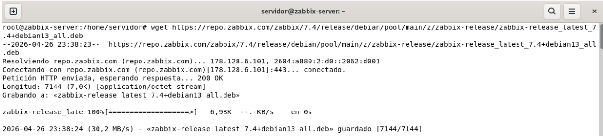

Y con este comando lo instalamos:

```bash
dpkg -i zabbix-release_latest_7.4+debian13_all.deb
```

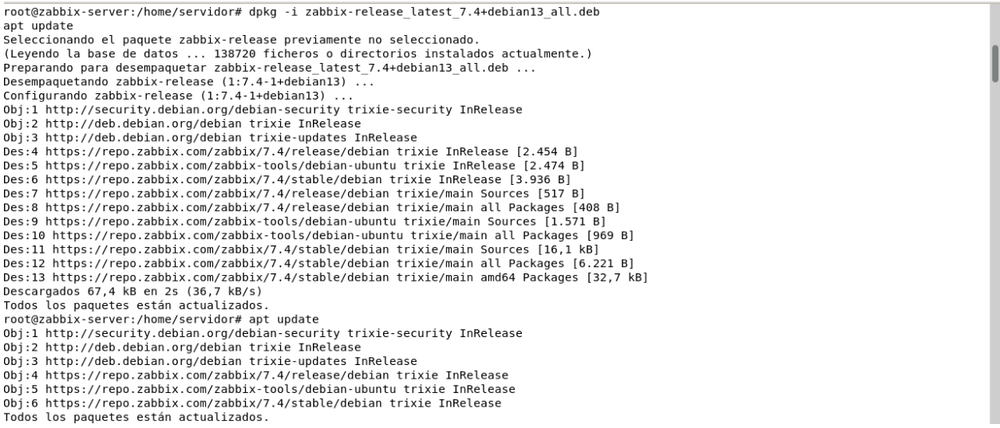

Actualizamos los repositorios:

```bash
apt update
```

---

## 6. Instalación de paquetes necesarios

Ahora podemos instalar los paquetes necesarios:

```bash
apt install -y zabbix-server-mysql zabbix-frontend-php zabbix-nginx-conf zabbix-sql-scripts zabbix-agent2 mariadb-server nginx
```

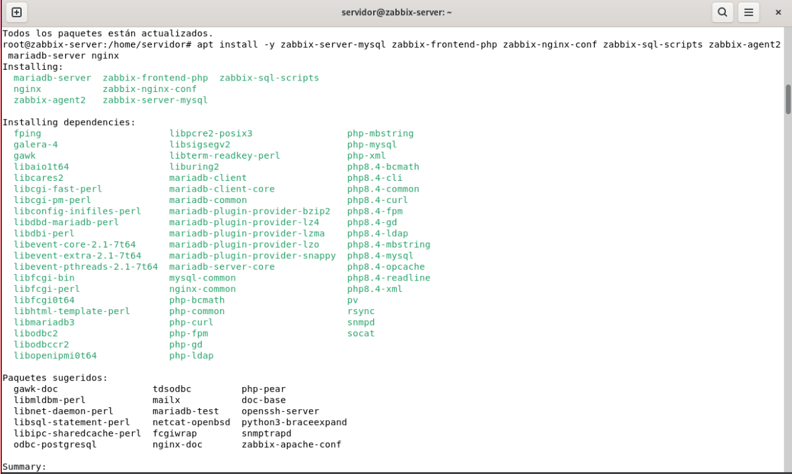

### Resumen de los paquetes instalados

| Paquete | Función |
|---|---|
| `zabbix-server-mysql` | Servidor Zabbix con soporte MySQL/MariaDB |
| `zabbix-frontend-php` | Interfaz web de Zabbix |
| `zabbix-nginx-conf` | Configuración de Nginx para Zabbix |
| `zabbix-sql-scripts` | Scripts iniciales de la base de datos |
| `zabbix-agent2` | Agente moderno de Zabbix |
| `mariadb-server` | Base de datos |
| `nginx` | Servidor web |

---

## 7. Configuración de la base de datos

Vamos con la configuración de la base de datos.

Activamos MariaDB:

```bash
systemctl enable --now mariadb
```

Ejecutamos la configuración segura:

```bash
mariadb-secure-installation
```

Yo elegí estas opciones:

```text
Switch to unix_socket authentication? n
Change the root password? n
Remove anonymous users? y
Disallow root login remotely? y
Remove test database? y
Reload privilege tables? y
```

Entramos dentro de MariaDB:

```bash
mariadb
```

Y ejecutamos estos comandos:

```sql
CREATE DATABASE zabbix CHARACTER SET utf8mb4 COLLATE utf8mb4_bin;
CREATE USER 'zabbix'@'localhost' IDENTIFIED BY 'adminmariadb';
GRANT ALL PRIVILEGES ON zabbix.* TO 'zabbix'@'localhost';
SET GLOBAL log_bin_trust_function_creators = 1;
FLUSH PRIVILEGES;
EXIT;
```

Con este comando importamos la base de datos inicial:

```bash
zcat /usr/share/zabbix/sql-scripts/mysql/server.sql.gz | mariadb --default-character-set=utf8mb4 -uzabbix -p zabbix
```

Una vez instalada, nos volvemos a meter en MariaDB:

```bash
mariadb
```

Y ejecutamos:

```sql
SET GLOBAL log_bin_trust_function_creators = 0;
EXIT;
```

---

## 8. Configuración de Zabbix Server

Configuramos el archivo de Zabbix:

```bash
nano /etc/zabbix/zabbix_server.conf
```

Buscamos esta línea:

```bash
# DBPassword=
```

Y añadimos la contraseña de la base de datos:

```bash
DBPassword=adminmariadb
```

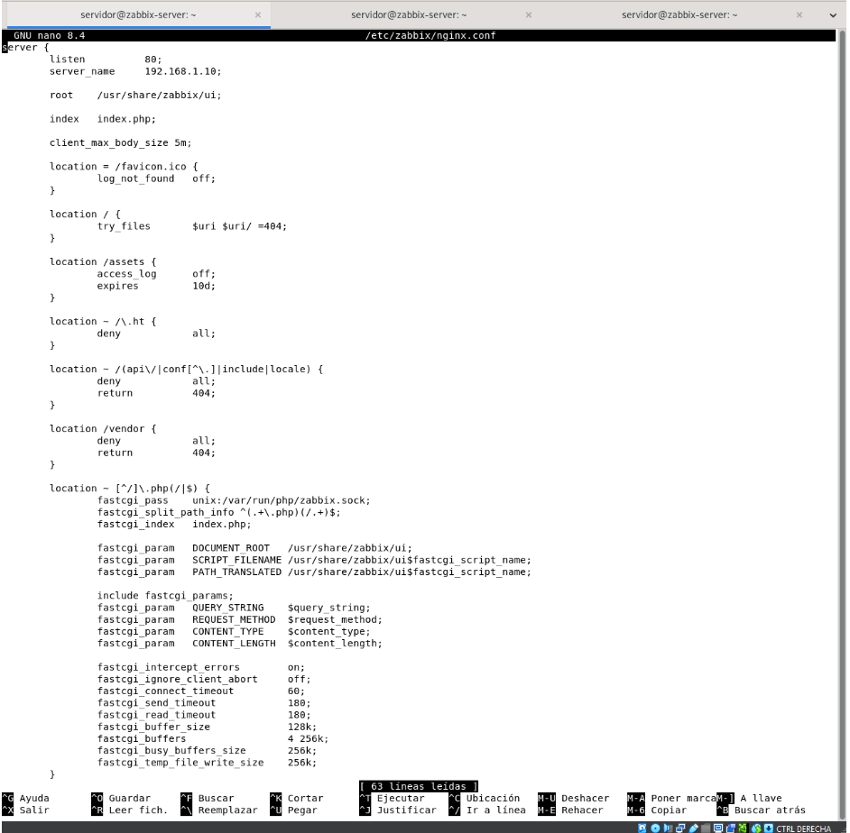

---

## 9. Configuración de Nginx para Zabbix

Editamos el archivo de configuración de Nginx para Zabbix:

```bash
nano /etc/zabbix/nginx.conf
```

Configuramos estas líneas:

```nginx
listen 80;
server_name 192.168.1.10;
```

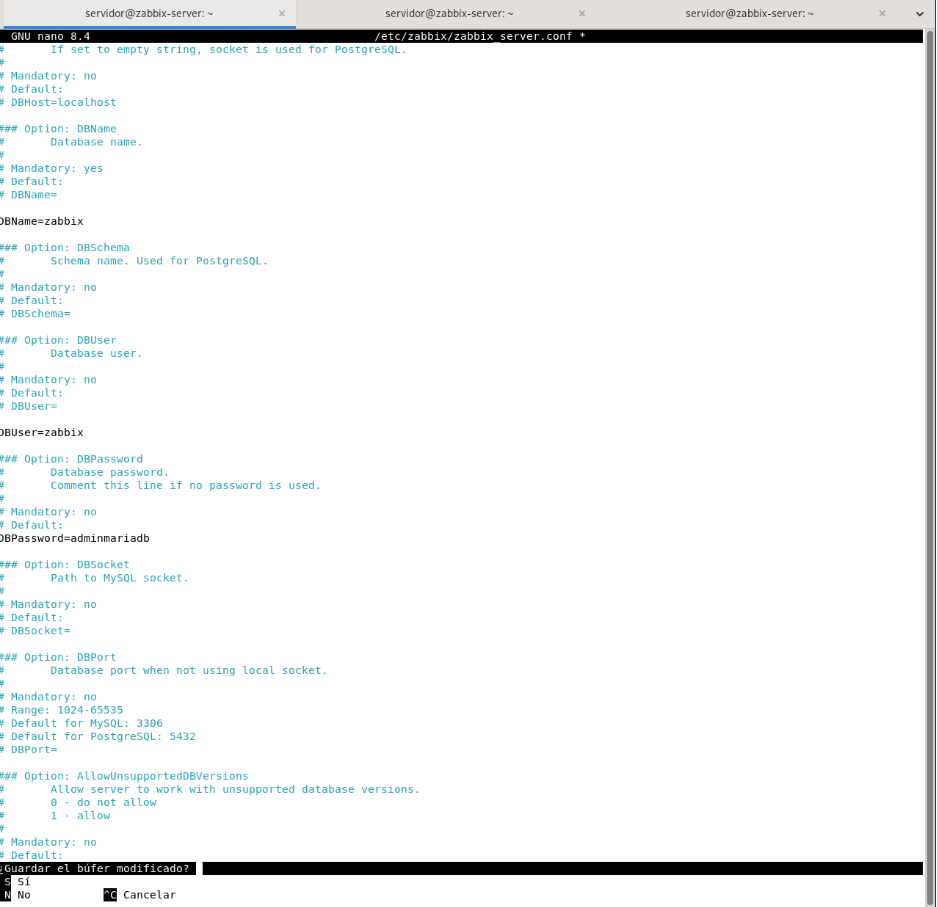

---

## 10. Reiniciar y activar servicios

Reiniciamos los servicios:

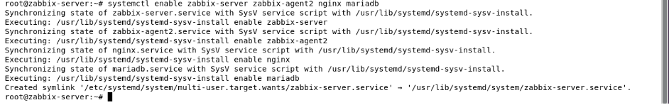

```bash
systemctl restart zabbix-server zabbix-agent2 nginx php*-fpm
```

Activamos los servicios para que se inicien automáticamente:

```bash
systemctl enable zabbix-server zabbix-agent2 nginx mariadb
```

Comprobamos el estado del servidor Zabbix:

```bash
systemctl status zabbix-server
```

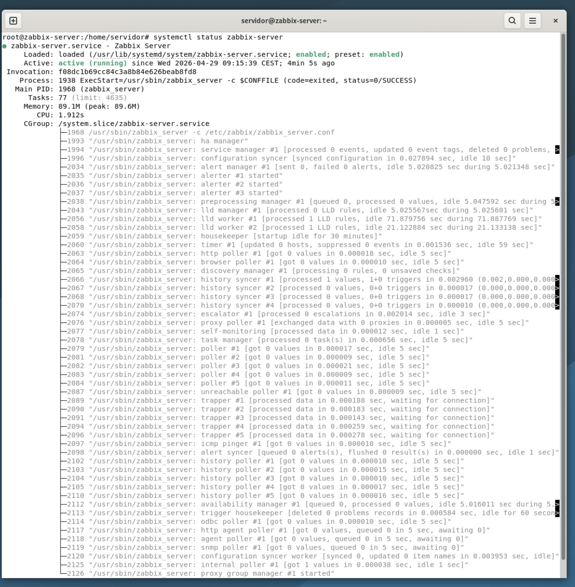

Comprobamos el estado del agente Zabbix:

```bash
systemctl status zabbix-agent2
```

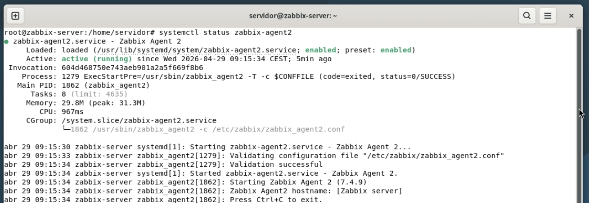

Comprobamos el estado de Nginx:

```bash
systemctl status nginx
```

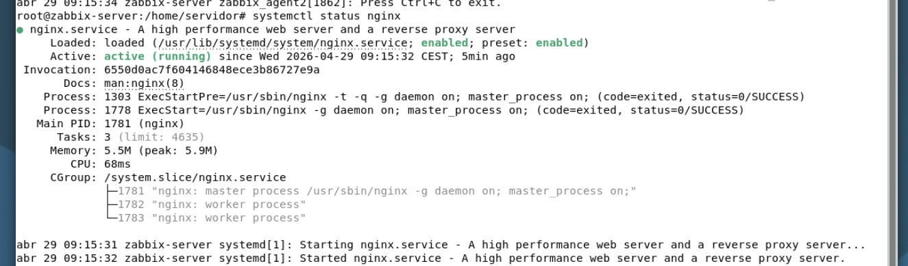

Comprobamos el estado de MariaDB:

```bash
systemctl status mariadb
```

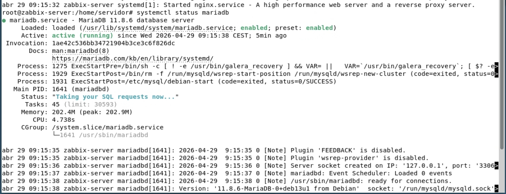

---

## 11. Comprobaciones adicionales

Comprobar que Nginx no tiene errores:

```bash
nginx -t
```

Ver la versión o servicio de PHP-FPM:

```bash
systemctl list-units --type=service | grep fpm
```

---

## 12. Configuración del firewall

Ahora configuramos el firewall.

Instalamos UFW:

```bash
apt install -y ufw
```

Configuramos el firewall con estos comandos:

```bash
ufw allow 22/tcp
ufw allow 80/tcp
ufw allow 10051/tcp
ufw enable
ufw status
```

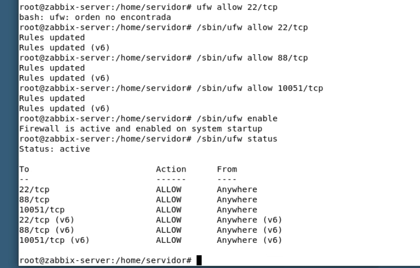

Más adelante abriremos el puerto `443/tcp` cuando configuremos HTTPS.

---

## 13. Acceso a la interfaz web de Zabbix

Ya podemos entrar en la web:

```text
http://192.168.1.10
```

Tras el primer inicio de sesión se debe cambiar la contraseña por defecto del usuario `Admin` por motivos de seguridad.

### Instalación desde la web

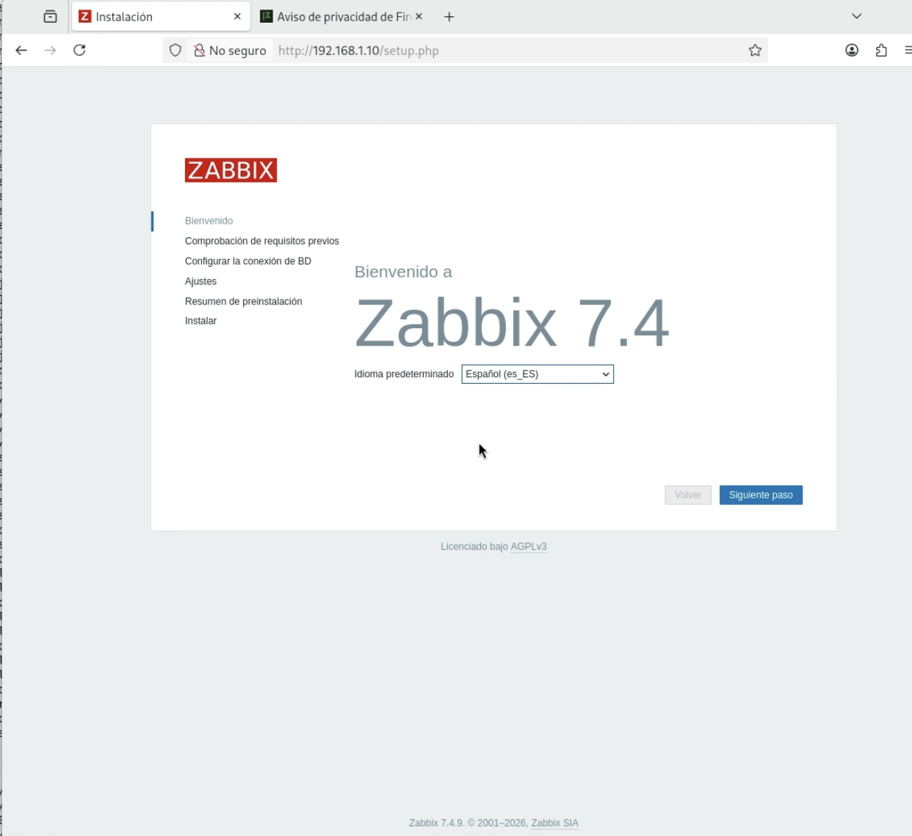

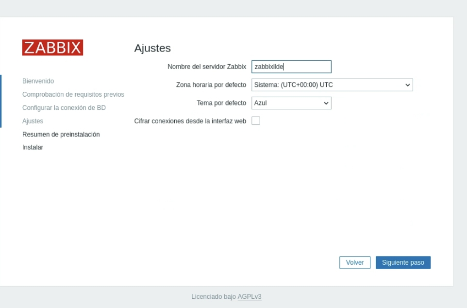

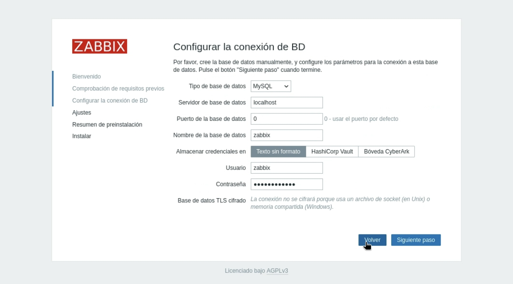

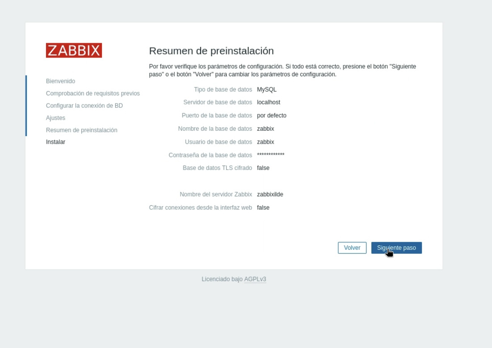

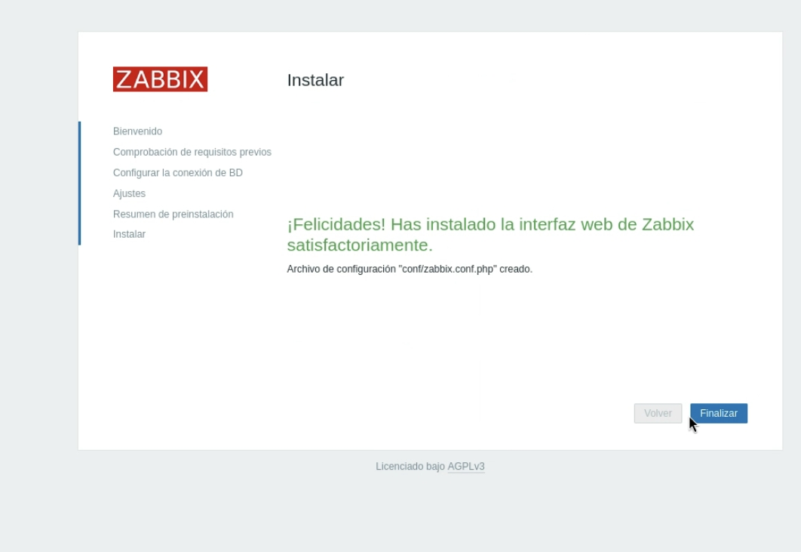

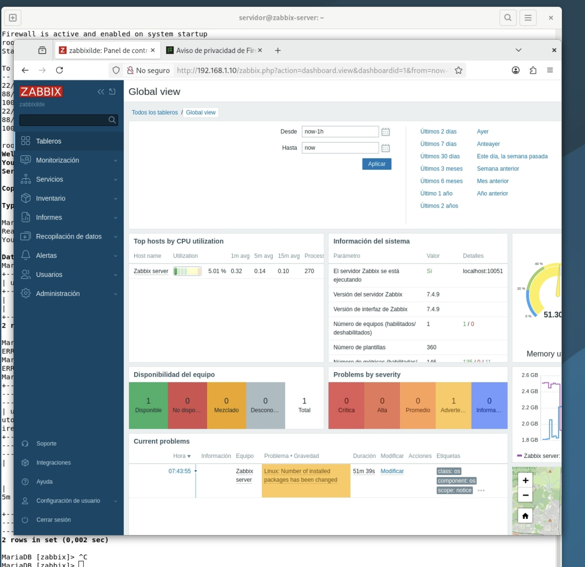

Credenciales por defecto:

```text
Usuario: Admin
Contraseña: zabbix
```

---

## 14. Comandos útiles si algo falla

Ver log del servidor Zabbix:

```bash
tail -f /var/log/zabbix/zabbix_server.log
```

Ver log de Nginx:

```bash
journalctl -u nginx -f
```

Ver log de MariaDB:

```bash
journalctl -u mariadb -f
```

Ver estado de Zabbix:

```bash
systemctl status zabbix-server
```

Comprobar puertos abiertos:

```bash
ss -tulpn
```

Comprobar si Zabbix escucha en el puerto `10051`:

```bash
ss -tulpn | grep 10051
```

Comprobar si Nginx escucha en el puerto `80`:

```bash
ss -tulpn | grep ':80'
```


# Monitorizar el propio servidor

a mi me gusta tenerlo tambien monitorizado pero no es estrictamente necesario

# comprobar que el agente está instalado
ya deberia estar instalado pero siempre es bueno comprobar en caso de que no lo instalases antes ya que no siempre es necesario

```bash
systemctl status zabbix-agent2
```
si no esta activo 

```bash
systemctl enable --now zabbix-agent2
```

# configuramos el archivo del agente


```bash
nano /etc/zabbix/zabbix_agent2.conf
```
dentro buscar y modificar las siguientes lineas


```text
Server=127.0.0.1
ServerActive=127.0.0.1
Hostname=Zabbix server  
```
en este caso solo cambiamos el hostname por el del servidor

reiniciamos los servicios

```bash
systemctl restart zabbix-agent2
systemctl status zabbix-agent2
```

# En el panel web nos vamos a los siguientes

```text
Data collection → Hosts
```

configuramos su interfaz

```text
Interfaces → Agent
```

```text
IP address: 127.0.0.1
DNS name: vacío
Connect to: IP
Port: 10050
```

como es el propio servidor lo dejamos con `127.0.0.1`

## plantillas

En el mismo host ve a:

```text
Templates
```


Añade esta plantilla:

```text
Linux by Zabbix agent
```

Si estás usando checks activos, también podrías usar:

```text
Linux by Zabbix agent active
```

Pero por ahora recomiendo usar la primera es más fácil para comprobar que funciona

Guarda los cambios con:

```text
Update
```

# comprobar que funciona

```text
Data collection → Hosts
```


Espera 1 o 2 minutos.

En la columna de disponibilidad debería aparecer el icono de ZBX en verde.

Si aparece verde, perfecto: el servidor ya se está monitorizando.

mira en:

```text
Monitoring → Latest data
```

Filtra por host:

```text
zabbix-server
```

Deberías ver métricas como:

```text
CPU utilization
Memory utilization
Available memory
Disk space
Network traffic
System uptime
```

También puedes ir a:

```text
Monitoring → Hosts
```

y tienes varias opciones con graficos y mas

para comprobar que realmente recibe datos prueba en el servidor este comando y vuelve a mirar

```bash
uptime
free -h
df -h
```


# en caso de que algo no vaya 

comprobar lo siguiente.

##  comprobar si el agente escucha en el puerto 10050

```bash
ss -tulpn | grep 10050
```

Debe aparecer `zabbix_agent2`.

## ver si el servicio está activo

```bash
systemctl status zabbix-agent2
```

##  comprobar que el nombre coincide

Comprueba el nombre configurado en el agente:

```bash
grep -E "^Hostname=|^Server=|^ServerActive=" /etc/zabbix/zabbix_agent2.conf
```

Si pone:

```text
Hostname=zabbix-server
```

el host en el frontend debe llamarse exactamente:

```text
zabbix-server
```

##  log del agente

```bash
tail -f /var/log/zabbix/zabbix_agent2.log
```

## miira el log del servidor

```bash
tail -f /var/log/zabbix/zabbix_server.log
```

