# configurar alertas

esta es una de las partes mas importantes,
ya que zabbix nos avisara no solo con metricas en la web sino que ademas podremos estar al tanto de todo en cualquier momento con mensajes al movil (telegram) o al correo

Zabbix permite configurar distintos métodos de aviso mediante los tipos de medios. Entre los métodos más habituales se encuentran el correo electrónico, SMS, scripts personalizados y webhooks. Gracias a los webhooks, Zabbix puede integrarse con plataformas externas como Telegram, Discord, Slack o Microsoft Teams.

En este proyecto se configuraron alertas mediante Telegram y correo electrónico, ya que permiten demostrar de forma sencilla y visual el funcionamiento del sistema de notificaciones. Como posibles ampliaciones futuras se podrían añadir integraciones con Discord, Slack, Microsoft Teams o scripts personalizados.

---

## como funcionan las alertas

las alertas siguen este orden

```text
Métrica → Iniciador → Problema → Acción → Medio de aviso → Usuario
```

un ejemplo seria este:

```text
HTTP deja de responder → se activa el iniciador → aparece en Problemas → Zabbix ejecuta una acción → te llega una alerta por Telegram o correo 
```

Zabbix llama tipos de medios a los canales por los que envía notificaciones, como correo, SMS, scripts o webhooks. Para que una alerta llegue a un usuario hacen falta tres cosas: una acción que envíe la notificación, un tipo de medio configurado y un medio asignado al usuario.

https://www.zabbix.com/documentation/current/en/manual/config/notifications/

---

## 1 primer tipo de alerta

la primera que recomiendo hacer es por telegram

motivos:

- es facil de hacer
- suele llegar rapido
- te llega al movil 

---

## como lo haremos

```text
Tipo de medio: Telegram
Usuario: Admin o tu usuario personal
Acción: Notificar problemas importantes
Prueba: parar nginx, ssh o zabbix-agent2
Resultado: mensaje en Telegram
```

---

## 1-crear bot en telegram

nos vamos a telegram y buscamos 

```text
@botfather
```

```text
create new bot
```

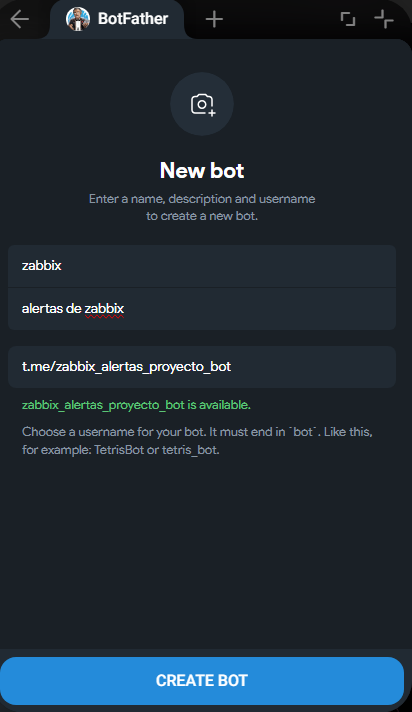

copiamos el token

mi token

```text
8430463255:AAEXZ9M1Yu9R6tpHnZlPASVLKE8kh9ySKLc
```

para poder sacar el chat id debemos hablarle al bot con un mensaje cualquiera

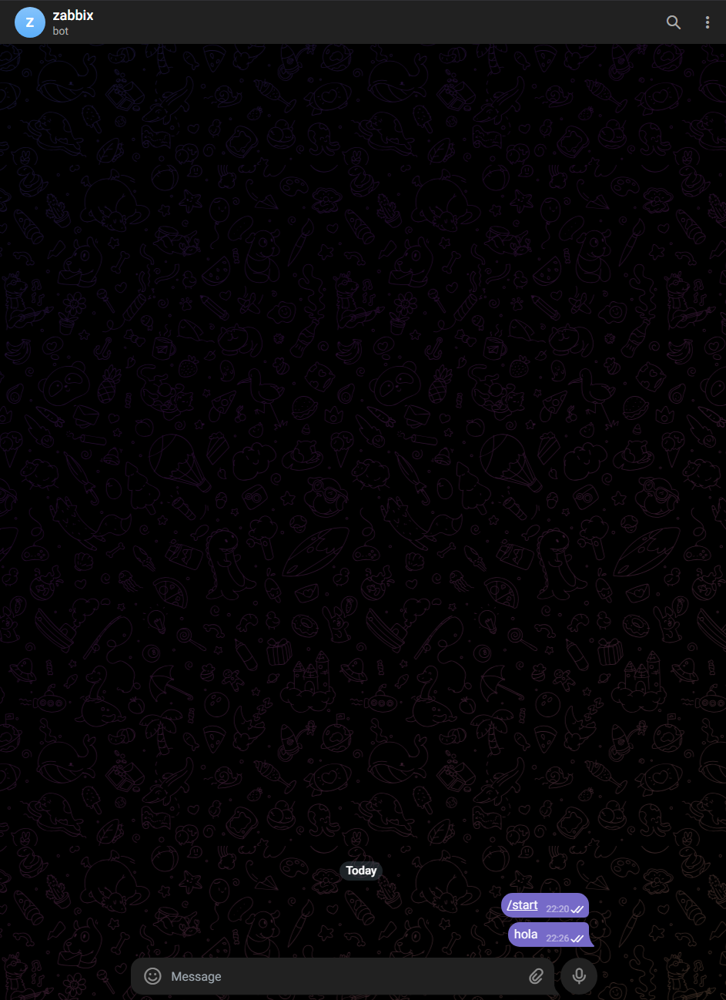

y ponemos esta url en el navegador 

```text
https://api.telegram.org/botTOKEN_DEL_BOT/getUpdates
```

cambiamos el token por el nuestro y recuerda dejar bot antes del token

y buscamos algo como el chat id

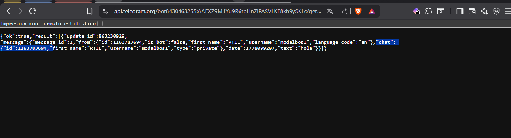

mi chat id

```json
"chat":{"id":1163783694}
```

---

## 2-crear tipo de medio en zabbix

```text
Alertas → Tipos de medios
```

busca: telegram

suele venir ya importado pero en caso de que no, tendrás que importarlo como webhook, pero normalmente Zabbix trae varios medios predefinidos. Los webhooks se configuran desde Alertas → Tipos de medios, y Zabbix permite importar webhooks preconfigurados y ajustar sus parámetros según el servicio.

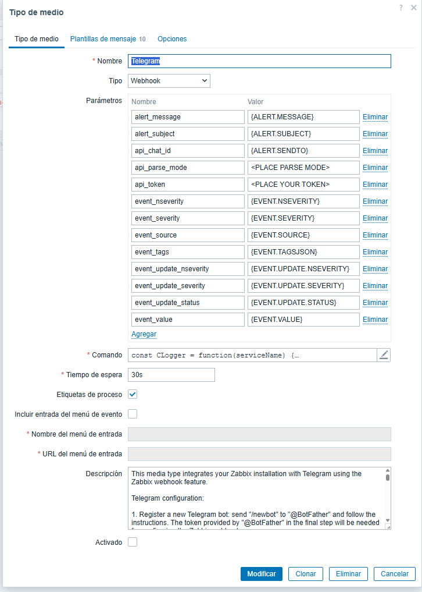

y empezamos a editar

solo cambiamos estas dos

```text
api_parse_mode: HTML (sirve para decirle a Telegram que el mensaje puede llevar formato HTML básico.)
```

```html
<b>Problema:</b> HTTP caído
<i>Gravedad:</i> Alta
```

```text
api_token: pegamos el token
```

```text
api_chat_id: lo dejamos sin tocar significa que Zabbix usará el valor que pongas luego en el usuario.
```

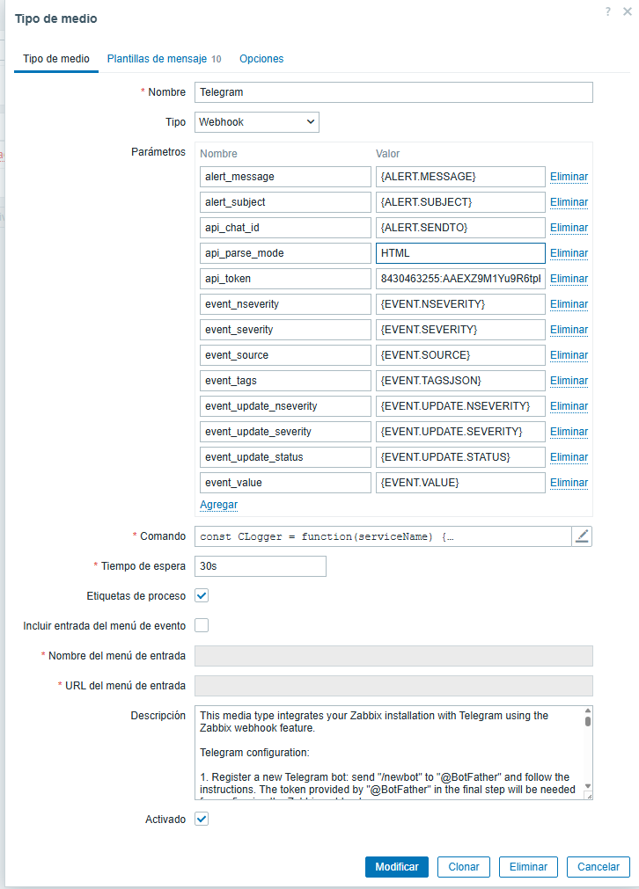

ahora nos vamos a Usuarios → Usuarios → Admin → Medios → agregar

```text
Tipo: Telegram
Enviar a: tu_chat_id
```

esta vez marcare todos los niveles de alerta pero lo mejor seria hacer mas de un bot para diferentes niveles de alerta para poder tenerlo mas organizado

y guardamos

podemo probar que llega

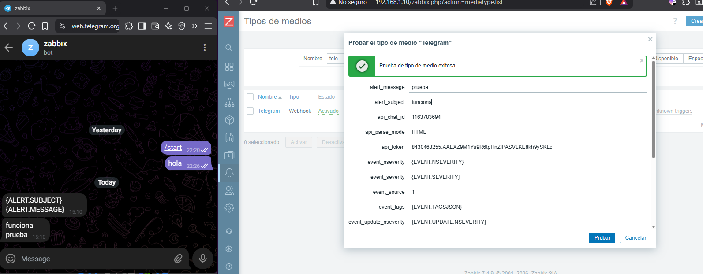

---

## 3-crear alerta en zabbix

ahora toca crear la alerta iremos

```text
Alertas → Acciones → Acciones de iniciador
```

nueva accion 

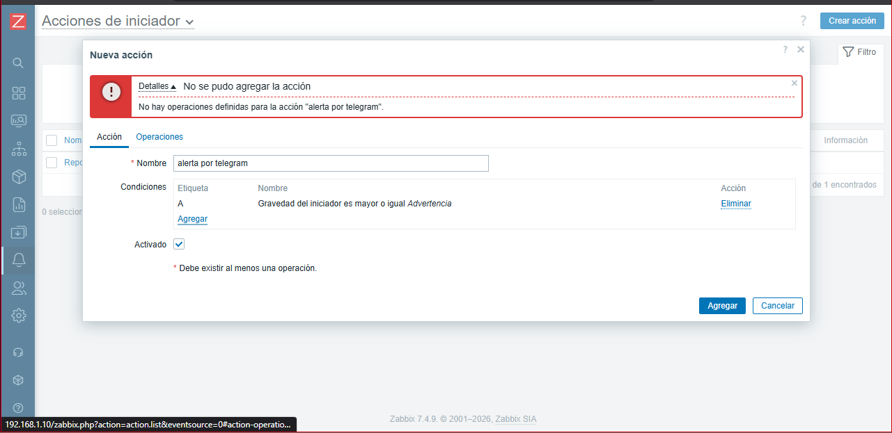

y agregamos la operacion

que sea enviada a admin solo por telegram

para cuando salte el problema:

Asunto:
```text
Problema: {EVENT.NAME}
```
Mensaje:

```text
Problema detectado en Zabbix

Equipo: {HOST.NAME}
Problema: {EVENT.NAME}
Gravedad: {EVENT.SEVERITY}
Hora: {EVENT.DATE} {EVENT.TIME}
Estado: {EVENT.STATUS}
Valor: {ITEM.LASTVALUE}

URL: {EVENT.URL}
```
para cuando este resuelto:

Asunto:

```text
Resuelto: {EVENT.NAME}
```

Mensaje:

```text
Problema resuelto en Zabbix

Equipo: {HOST.NAME}
Problema: {EVENT.NAME}
Gravedad: {EVENT.SEVERITY}
Hora de recuperación: {EVENT.RECOVERY.DATE} {EVENT.RECOVERY.TIME}
Estado: {EVENT.STATUS}
```

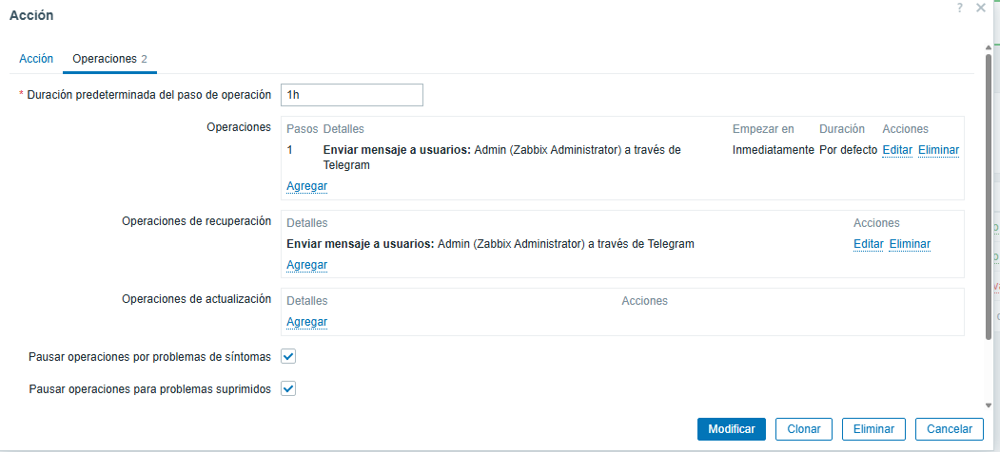

Pestaña Operaciones de actualización

Esta parte vamos a dejarla sin tocar por ahora.

---

## 4-probar la alerta 

pararemos el servicio de zabbix y despues de unos 30-60 segundos deberia llegar

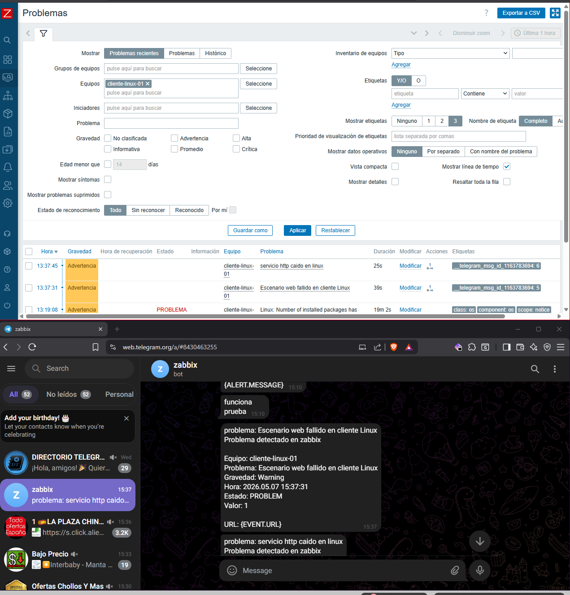

algunos que recomiendo comprobar para asegurarte que funcionan todos

| Prueba | Host | Comando | Alerta esperada |
| --- | --- | --- | --- |
| HTTP caído | `cliente-linux-01` | `sudo systemctl stop nginx` | Aviso Telegram de HTTP caído |
| SSH caído | `cliente-linux-01` | `sudo systemctl stop ssh` | Aviso Telegram de SSH caído |
| Agente Linux caído | `cliente-linux-01` | `sudo systemctl stop zabbix-agent2` | Aviso Telegram de agente sin datos |
| Agente Windows caído | `windows-cliente-02` | `Stop-Service "Zabbix Agent 2"` | Aviso Telegram de agente sin datos |
| MariaDB caída | `zabbix-server` | `systemctl stop mariadb` | Aviso Telegram de MariaDB caída |

---

en caso de que algo no te vaya puedes asegurate de estas cosas:

1. El bot tiene token correcto.
2. Has escrito al bot antes de probar.
3. El chat ID es correcto.
4. El tipo de medio Telegram está activado.
5. El usuario tiene Telegram en la pestaña Medios.
6. La acción está activada.
7. La gravedad del problema está incluida.
8. El problema aparece en Monitorización → Problemas.

---

## 5-el otro metodo es con el email

creamos el medio

con estos datos

```text
Servidor SMTP: smtp.gmail.com
Puerto del servidor SMTP: 587
Correo electrónico: tu_correo@gmail.com
SMTP helo: gmail.com
Seguridad de la conexión: STARTTLS
Autenticación: Usuario y contraseña
Usuario: tu_correo@gmail.com
Contraseña: contraseña_de_aplicación 
Formato de mensaje: HTML
```

pasos para la contraseña de aplicacion -->  [Pasos para crear la contraseña de aplicación](../configuraciones/contraseña-correo-aplicacion.md)

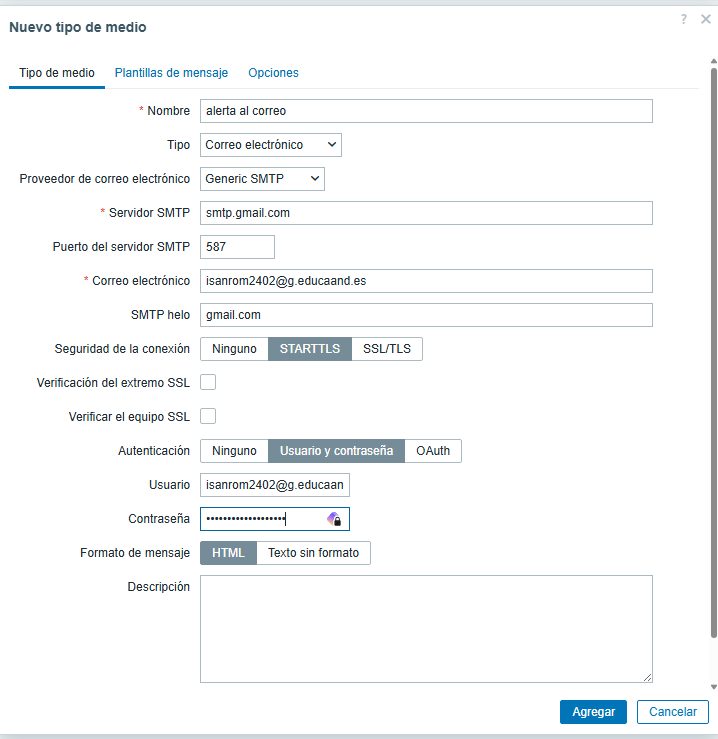

y lo añadimos al usuario

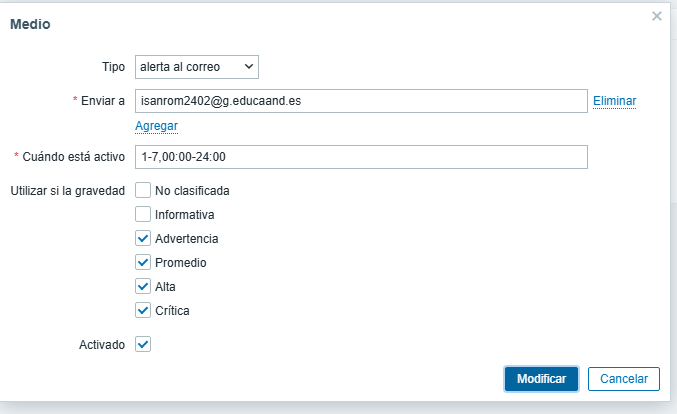

y hacemos la prueba

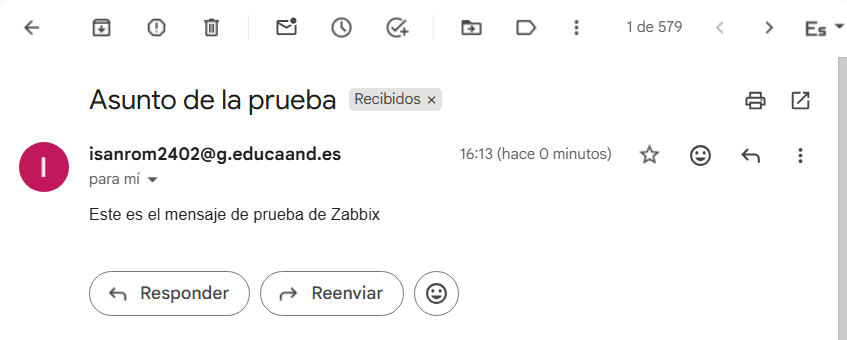

hacemos lo mismo que con telegram respecto a las acciones y luego probamos 

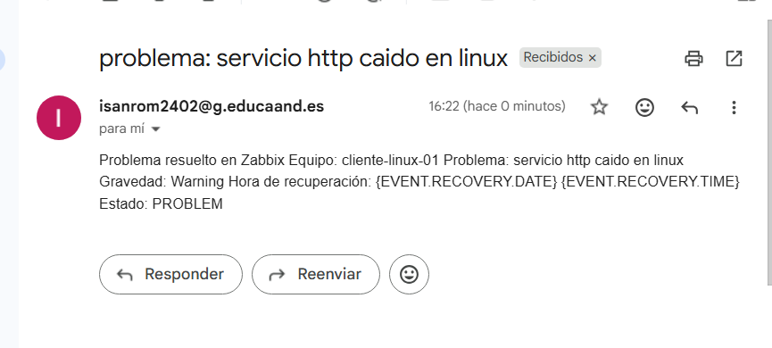

---

## extra

**Telegram:**

Envía mensajes a un chat personal o grupo mediante un bot.

**Correo electrónico:**

Envía alertas usando un servidor SMTP, por ejemplo Gmail, Outlook o un servidor propio.

**Discord:**

Envía alertas a un canal de Discord mediante un webhook.

**Slack:**

Envía notificaciones a un canal de trabajo mediante webhook.

**Microsoft Teams:**

Envía avisos a un canal de Teams, útil en entornos empresariales.

**SMS:**

Permite enviar mensajes SMS, normalmente usando un módem GSM o servicio externo.

**Script personalizado:**

Ejecuta un script creado por el administrador, por ejemplo un script Bash o Python.

**Webhook genérico:**

Permite enviar datos de Zabbix a cualquier API externa compatible.
