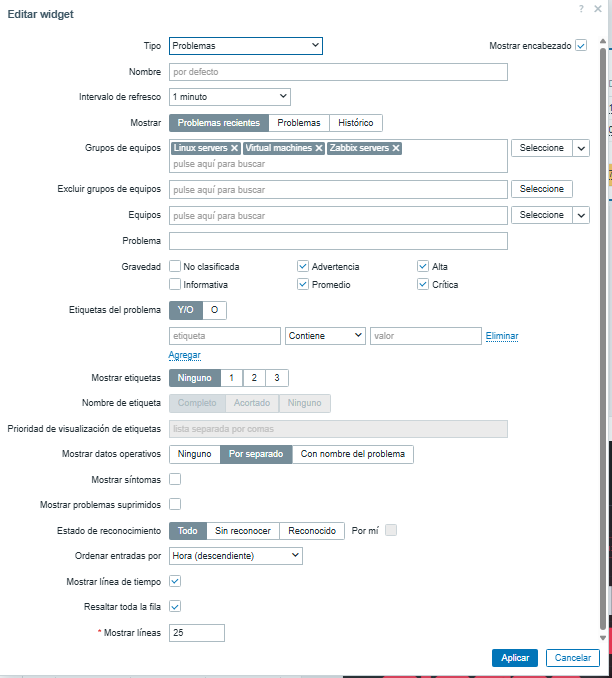
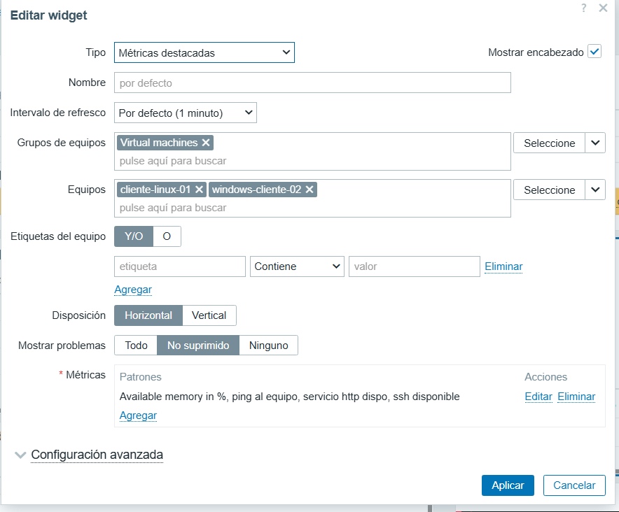
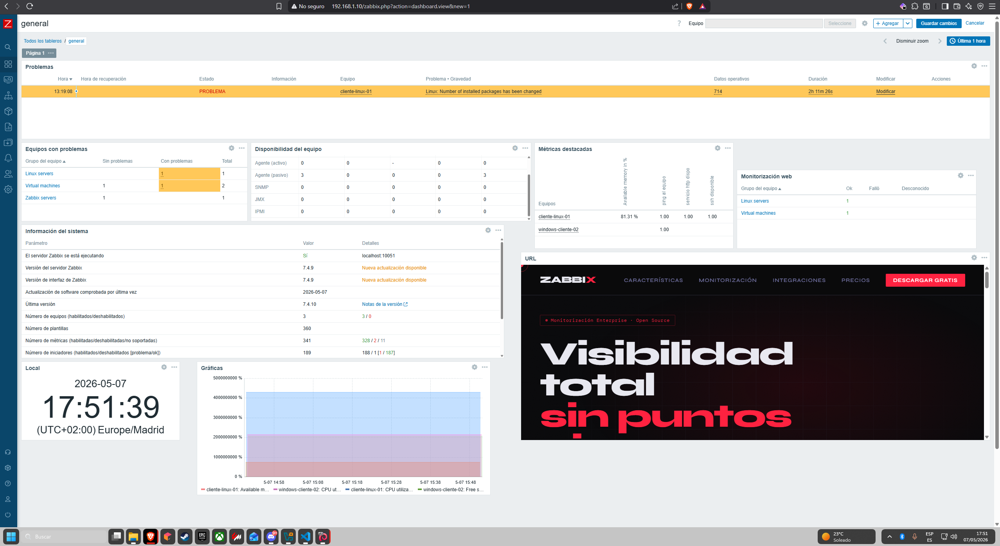
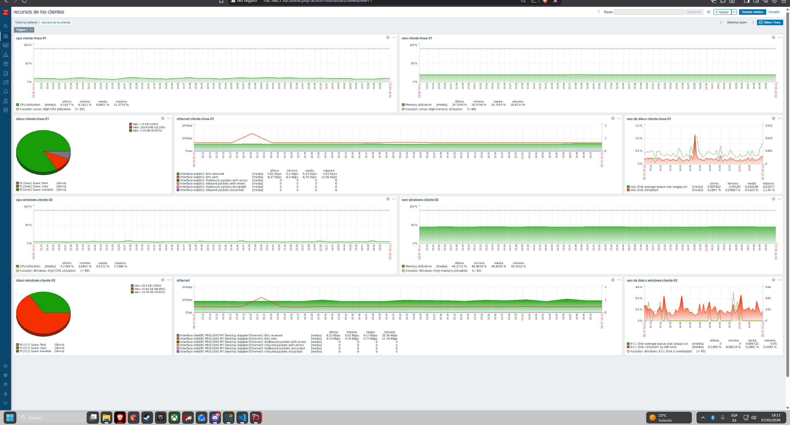

# dashboards en zabbix

Los dashboards son paneles formados por widgets que permiten visualizar problemas, disponibilidad, gráficas y métricas importantes de forma rápida.

## 1. crear dashboard 

es sencillo solo debemos irnos a tableros y desde ahi tenemos los que vienen por defecto y podemos crear los nuestros propios

Tableros → Crear tablero

Tableros → Monitorización general ASIR → Editar tablero → Añadir widget

## 2. crear los nuestros propios 

la cosa es tener 2 uno general con los problemas, informacion de equipo, la disponibilidad de los mismos y algunas cosas mas 

el otro ya con graficas de cada host o podemos hacer un dashboard para cada host aunque ya cada uno tiene el suyo creado por defecto y en casos de muchos equipos seria un poco innecesario

yo hare solo dos pero puedes organizarlo como quieras

## 3. dashboard general

la creacion de dashboard es muy intuitiva y te permite modificarlo a tu antojo

los widgets que yo pondria aqui

| Widget                    | Para qué sirve                                    |
| ------------------------- | ------------------------------------------------- |
| Problemas                 | Ver incidencias activas                           |
| Equipos con problemas     | Ver qué host tiene fallos                         |
| Disponibilidad de equipos | Ver si los agentes están disponibles              |
| Web monitoring            | Ver estado de escenarios web                      |
| Reloj                     | Decorativo pero útil para capturas                |
| Valor de elemento         | Mostrar valores concretos como ping o estado HTTP |

los valores que yo puse en cada widget

en este ejemplo podemos ver que modificar

podemos elegir grupos de equipos los cuales ver y ademas podemos excluir los equipos especificos que no queramos que aparezcan

podemos elegir los niveles de gravedad

podemos poner etiquetas, modificar la prioridad, el como se ven los datos, y mas

otra por ejemplo

podemos elegir metricas especificas para ver y de que equipos son junto con los valores

realmente modificar los widgets es muy sencillo una vez llegas hasta este punto y la organizacion ya dependera de tu gusto 

## 4. dasboard de recursos principales clientes

los recursos principales a monitorizar serian estos

| Widget                | Host               | Métrica                  |
| --------------------- | ------------------ | ------------------------ |
| Gráfico CPU Linux     | cliente-linux-01   | CPU utilization          |
| Gráfico RAM Linux     | cliente-linux-01   | Memory utilization       |
| Gráfico disco Linux   | cliente-linux-01   | Disk space / utilization |
| Gráfico CPU Windows   | windows-cliente-02 | CPU utilization          |
| Gráfico RAM Windows   | windows-cliente-02 | Memory utilization       |
| Gráfico disco Windows | windows-cliente-02 | C: Space utilization     |
| Gráfico servidor      | zabbix-server      | CPU/RAM/Disco            |

## Conclusión

En resumen, los dashboards de Zabbix son una herramienta muy útil para visualizar de forma rápida el estado del sistema monitorizado. Gracias a los widgets, es posible mostrar en un mismo panel información importante como problemas activos, disponibilidad de equipos, estado de servicios, gráficas de CPU, memoria RAM, disco y otros valores relevantes.

Además, son fáciles de modificar y adaptar según las necesidades del administrador. Esto permite crear paneles personalizados donde se muestre solo la información más importante, evitando tener que buscar manualmente cada métrica o problema dentro de la interfaz de Zabbix.

En este proyecto se han creado dashboards personalizados para tener una visión general del entorno y otra más técnica centrada en los recursos de los equipos. De esta forma, se facilita la detección rápida de incidencias y el seguimiento del estado de los hosts monitorizados.
