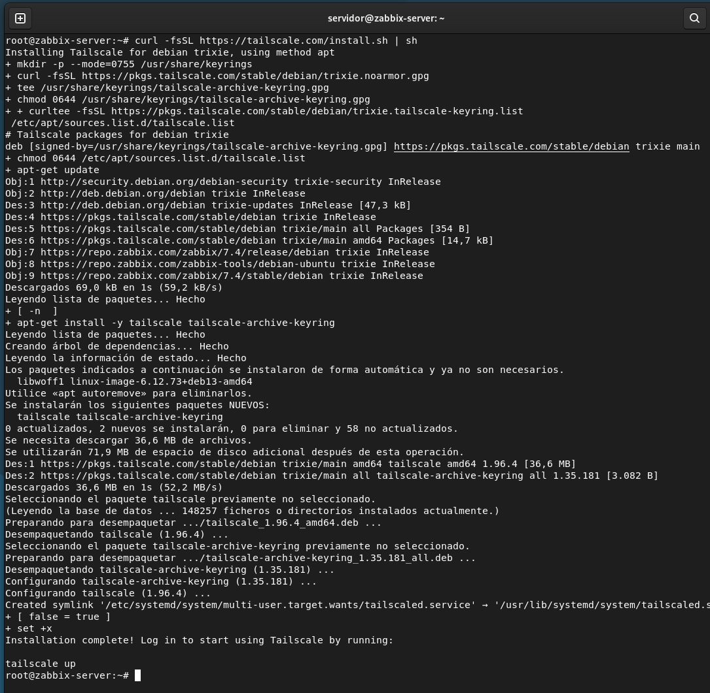
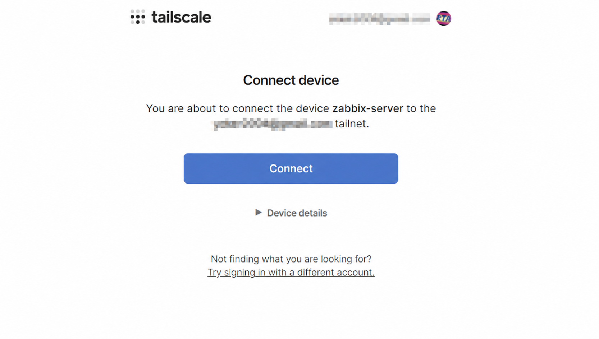
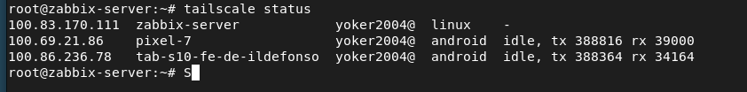

#conexion externa
ya para finalizar vamos configurar el servidor para poder acceder desde fuera con una vpn

la ruta que seguira sera esta

PC o móvil fuera de casa
        |
     Tailscale
        |
Servidor Zabbix Debian 13
        |
https://IP_TAILSCALE_DEL_SERVIDOR

## instalaremos tailscale

comando:curl -fsSL https://tailscale.com/install.sh | sh

Descarga y ejecuta el instalador oficial de Tailscale para Linux.
El script detecta Debian y configura el repositorio/paquete necesario.

## inicializar tailscale

con tailscale up nos saldra un link que debemos seguir para autenticar el servidor asi que le damos e iniciamos sesion o creamos una cuenta

una vez conectado podemos ver que esta activo en tailscale

ya con eso solo debemos instalar tailscale desde donde nos vayamos a conectar movil u otro dispositivo e iniciamos sesion con la misma cuenta y podremos conectarnos a nuestro servidor desde cualquier otro lugar gracias a que ambos estan en la misma red por la vpn de tailscale

y desde el servido podemos ver los dispositivos

algo que puedes hacer tambien es conectarte por ssh, no solo puedes conectarte a la pagina web yo para probar algunas cosas decidi conectarme desde el movil con la aplicacion de termius la cual esta en el play store y es bastante util
