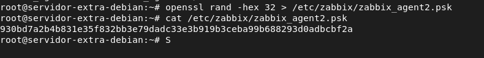
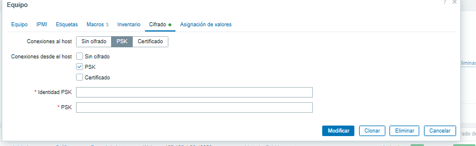

# 🔐 Cifrado PSK entre Zabbix Server y Zabbix Agent 2

## 1. Introducción
aqui veremos como configurar el cifrado psk entre nuestro servidor de monitorizacion y los clientes para tener una mayor seguridad en la comunicacion entre servidor --> cliente
## 2. Objetivo de la configuración
El objetivo de esta configuración es:

- Cifrar la comunicación entre Zabbix Server y Zabbix Agent 2.
- Evitar conexiones no autorizadas al agente.
- Mejorar la seguridad general del sistema de monitorización.
- Añadir una medida profesional de seguridad al proyecto.

## 3. Esquema

```text
Zabbix Server
     |
     | Comunicación cifrada mediante PSK
     |
Zabbix Agent 2
```
## 4. Equipos utilizados


| Equipo | Sistema | IP | Función |
|---|---|---|---|
| Zabbix Server | Debian 13 | 192.168.1.10 | Servidor de monitorización |
| servidor-extra-debian | Debian 13 | 192.168.1.11 | Agente monitorizado |
| cliente-linux-01 | Linux | 192.168.1.X | Agente monitorizado |
| windows-cliente-02 | Windows 10 | 192.168.1.X | Agente monitorizado |

## 5. Requisitos previos

Antes de configurar PSK, se debe tener:

- Zabbix Server instalado y funcionando.
- Zabbix Agent 2 instalado en el cliente.
- Comunicación entre servidor y agente.
- Host creado en Zabbix Web.
- Icono ZBX funcionando correctamente antes de activar el cifrado.

## 6. Creación de la clave PSK en el agente

## 7. Protección del archivo PSK en linux
chown zabbix:zabbix /etc/zabbix/zabbix_agent2.psk
chmod 600 /etc/zabbix/zabbix_agent2.psk
systemctl restart zabbix-agent2
## 8. Configuración de Zabbix Agent 2
en el archivo /etc/zabbix/zabbix_agent2.conf


TLSConnect=psk
 TLSAccept=psk
 TLSPSKIdentity=PSK-windows-cliente-02
 TLSPSKFile=C:\Program Files\Zabbix Agent 2\zabbix_agent2.psk


## 9. Configuración del cifrado en Zabbix Web


## 10. Prueba con zabbix_get usando PSK

```bash
zabbix_get \
-s 192.168.1.11 \
-k agent.ping \
--tls-connect psk \
--tls-psk-identity "PSK-servidor-extra-debian" \
--tls-psk-file /etc/zabbix/psk-servidor-extra-debian.psk
```
## 11. Configuración en Windows Agent 2

para windows debemos crear el archivo en C:\Program Files\Zabbix Agent 2\zabbix_agent2.psk

podemos crear una contraseña en hexadecimal en linux o en powershell y pegarla en el archivo 

y configuramos el conf cambiando estas lineas

 TLSConnect=psk
 TLSAccept=psk
 TLSPSKIdentity=PSK-windows-cliente-02
 TLSPSKFile=C:\Program Files\Zabbix Agent 2\zabbix_agent2.psk


cuidado con la extension de los archivos cuando creemos la clave lo haremos con este comando en powershell

```powershell
Set-Content -Path "C:\Program Files\Zabbix Agent 2\zabbix_agent2.psk" -Value "PEGA_AQUI_TU_CLAVE_PSK"
```


## 12. Justificación: por qué se eligió PSK
elegi psk es una solución sencilla y adecuada para un entorno de laboratorio.  
Permite cifrar la comunicación entre el servidor Zabbix y los agentes sin necesidad de montar una autoridad certificadora ni gestionar certificados individuales.

Es más sencilla que usar certificados.
No necesitas montar una autoridad certificadora.
No necesitas gestionar certificados por cada equipo.
Se configura rápido en Linux y Windows.
Aporta cifrado real entre servidor y agente.
Queda muy bien como mejora de seguridad en una memoria ASIR.

## 13. Comparación con otras opciones

| Opción | Ventajas | Desventajas |
|---|---|---|
| Sin cifrado | Muy fácil de configurar | Menor seguridad |
| PSK | Fácil, rápido y seguro para pocos equipos | Hay que proteger bien las claves |
| Certificados TLS | Más profesional para empresas grandes | Configuración más compleja |

## 14. Conclusión

Con esta configuración se ha añadido una capa de seguridad a la infraestructura de monitorización.  
Gracias al cifrado PSK, la comunicación entre Zabbix Server y los agentes queda protegida mediante una clave precompartida.

Esta medida mejora la seguridad del proyecto y demuestra la aplicación de buenas prácticas en la administración de sistemas.
