# Monitorizar servicios de nuestros clientes
ahora enseñare algunos servicios y como monitorizarlos ya que lo mas importante son los servicios que tenemos en cada equipo

hare algunos pero se pueden muchisimos mas a parte de estos que hare yo


```text
Ping / disponibilidad del equipo
SSH en Linux
HTTP en Linux
MariaDB en el servidor Zabbix
Agente Zabbix en Linux y Windows
Disco, CPU y RAM
```

La idea es que cada servicio tenga:

```text
1. Una métrica que recoge el dato
2. Un iniciador que detecta el fallo
3. Una forma de comprobarlo manualmente
4. Una prueba provocada para demostrarlo
```

Zabbix puede hacer comprobaciones mediante agente, comprobaciones simples, escenarios web y otros tipos de métricas. Las comprobaciones simples como `net.tcp.service[]` sirven para comprobar disponibilidad de servicios de red, y los escenarios web sirven para monitorizar HTTP/HTTPS de forma más completa. ([zabbix.com][1])

---

# 1. Monitorizar ping / disponibilidad

Esto sirve para saber si una máquina está encendida y responde en red.

## Qué monitorizar

Equipos:

```text
zabbix-server
cliente-linux-01
windows-cliente-02
```

Métrica recomendada:

```text
icmpping
icmppingloss
icmppingsec
```

Significado:

| Métrica           | Qué mide                    |
| -------------- | --------------------------- |
| `icmpping`     | Si el equipo responde al ping |
| `icmppingloss` | Pérdida de paquetes         |
| `icmppingsec`  | Tiempo de respuesta         |

---

## Cómo crearlo en Zabbix

Ve a:

```text
Recopilación de datos → Equipos → cliente-linux-01 → Métricas → Crear métrica
```

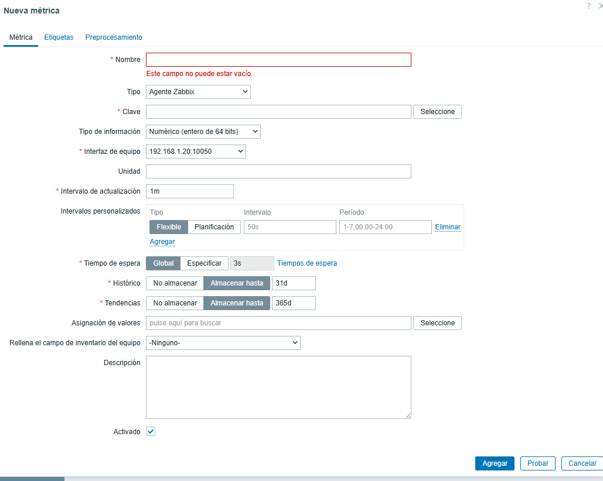

zabbix/imagenes/monitorizacionservicios/1.png

Configura:

```text
Nombre: Ping al cliente Linux
Tipo: Comprobación sencilla
Clave: icmpping
Tipo de información: Numérico sin signo
Intervalo de actualización: 30s
```

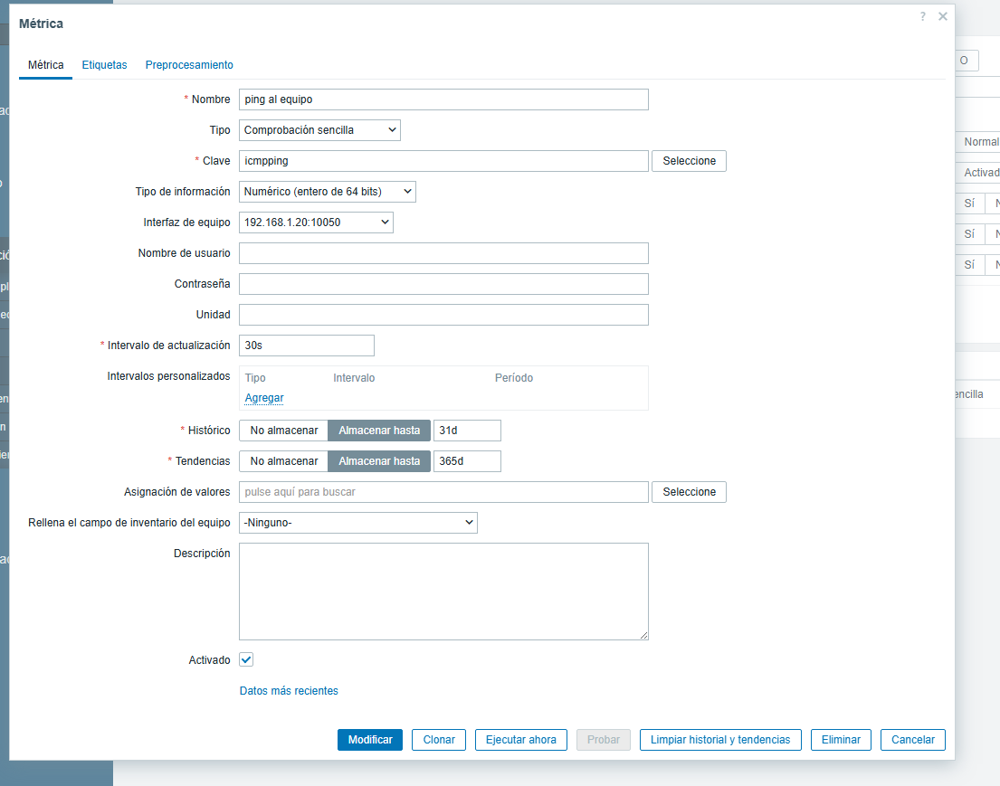

Guarda.

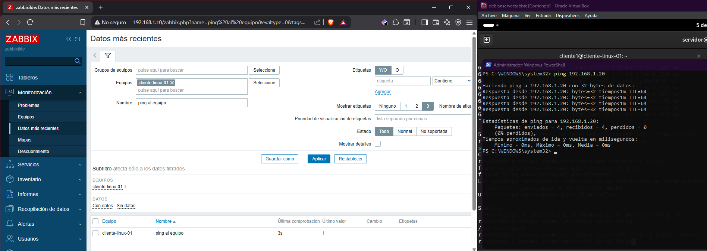


---

## Iniciador recomendado

Ve a:

```text
Recopilación de datos → Equipos → cliente-linux-01 → Iniciadores → Crear iniciador
```

Configura:

```text
Nombre: Cliente Linux no responde a ping
Gravedad: Alta
Expresión:
last(/cliente-linux-01/icmpping)=0
```

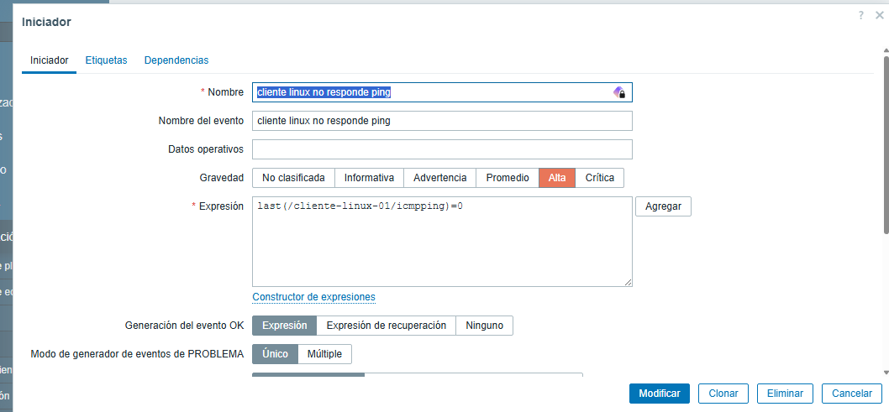

Este iniciador se activará cuando el último valor de `icmpping` sea `0`.

Las expresiones de iniciadores en Zabbix usan funciones como `last()`, `min()`, `max()` o `avg()` para evaluar valores históricos de métricas. ([zabbix.com][2])

---

## Cómo comprobarlo manualmente

ping desde fuera

linux:

windows:


servidor:

En Zabbix:

```text
Monitorización → Datos más recientes → Equipo: cliente-linux-01
```

Busca:

```text
Ping al cliente Linux
```

Debe valer:

```text
1
```

---

## Cómo provocar el fallo

Apaga el el objetivo

O desconecta temporalmente la red de la VM.

```text
Monitorización → Problemas → Cliente (linux/windows) no responde a ping
```

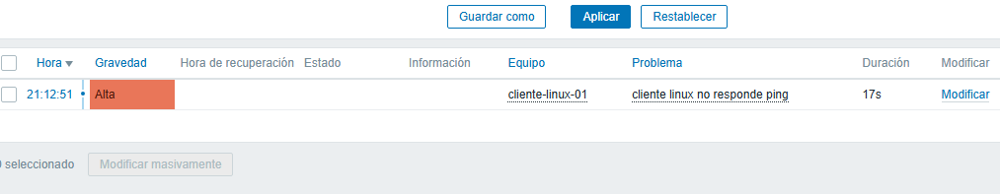
---

# 2. Monitorizar SSH en Linux

Esto sirve para comprobar que el servicio SSH está disponible.

## Qué monitorizar

Servicio:

```text
SSH puerto 22
```

Métrica recomendada:

```text
net.tcp.service[ssh]
```

Esto comprueba si el servicio SSH responde. Zabbix permite usar `net.tcp.service[]` para comprobar servicios TCP como SSH, HTTP, FTP, etc. ([zabbix.com][1])

---
deberiamos comprobar si tenemos instalados ssh y si el puerto esta abierto
Comprueba puerto:

```bash
ss -tulpn | grep ':22'
```

Desde el servidor Zabbix:

```bash
ssh usuario@192.168.1.20
```
---

## Crear métrica en Zabbix

Ve a:

```text
Recopilación de datos → Equipos → cliente-linux-01 → Métricas → Crear métrica
```

Configura:

```text
Nombre: Servicio SSH disponible
Tipo: Comprobación sencilla
Clave: net.tcp.service[ssh]
Tipo de información: Numérico sin signo
Intervalo de actualización: 30s
```
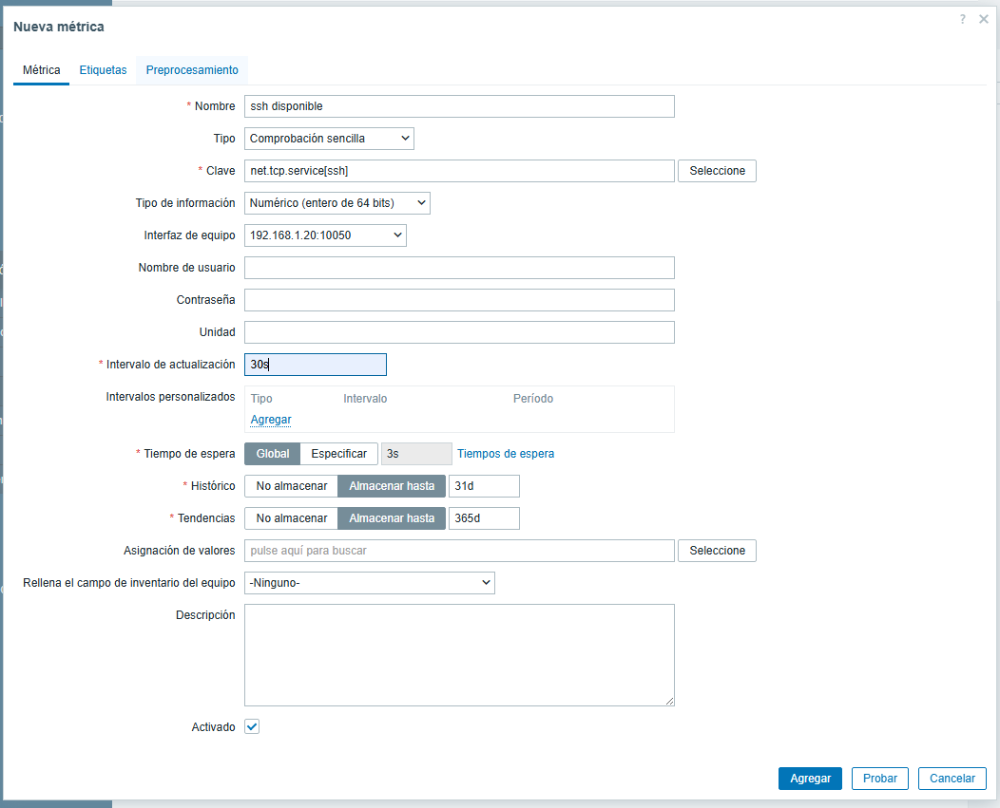

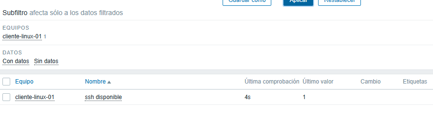

---

## Crear iniciador

```text
Nombre: SSH caído en cliente Linux
Gravedad: Promedio
Expresión:
last(/cliente-linux-01/net.tcp.service[ssh])=0
```

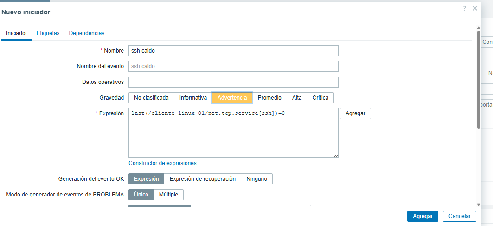

---

## Cómo comprobarlo

En Zabbix:

```text
Monitorización → Datos más recientes → Equipo: cliente-linux-01
```

Busca:

```text
Servicio SSH disponible
```

Debe valer:

```text
1
```

---

## Cómo provocar el fallo

En el cliente Linux:

```bash
sudo systemctl stop ssh
```

Espera 30-60 segundos.

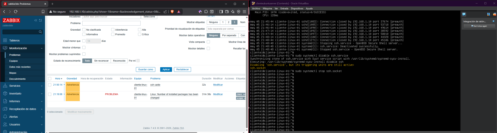

Para recuperarlo:

```bash
sudo systemctl start ssh
```

---

# 3. Monitorizar HTTP en Linux

| Método                  | Qué comprueba                            | Uso recomendado          |
| ----------------------- | ---------------------------------------- | ------------------------ |
| `net.tcp.service[http]` | Si el puerto 80 responde                 | Comprobación rápida      |
| Escenario web            | Si una página web responde correctamente | Comprobación profesional |

Zabbix soporta monitorización web HTTP y HTTPS mediante escenarios web. Estos permiten comprobar disponibilidad de una web, seguir redirecciones y recoger datos del escenario. ([zabbix.com][3])

---

## 3.1. Instalar Nginx en el cliente Linux

En `cliente-linux-01`:

instalamos nginx y lo configuramos

Desde el propio cliente:

```bash
curl http://localhost
```

Desde el servidor Zabbix:

```bash
curl http://192.168.1.20
```

Desde tu PC principal:

```text
http://192.168.1.20
```

---

## 3.2. Métrica simple para HTTP

hacer capturas de las cosas creadas

esta es la primera forma

En Zabbix:

```text
Recopilación de datos → Equipos → cliente-linux-01 → Métricas → Crear métrica
```

Configura:

```text
Nombre: Servicio HTTP disponible
Tipo: Comprobación sencilla
Clave: net.tcp.service[http]
Tipo de información: Numérico sin signo
Intervalo de actualización: 30s
```

Iniciador:

```text
Nombre: HTTP caído en cliente Linux
Gravedad: Promedio
Expresión:
last(/cliente-linux-01/net.tcp.service[http])=0
```

---

## Cómo comprobarlo

Desde el servidor:

```bash
zabbix_get -s 192.168.1.20 -k net.tcp.service[http]
```

Resultado esperado:

```text
1
```

También:

```bash
curl -I http://192.168.1.20
```

Resultado esperado:

```text
HTTP/1.1 200 OK
```

---

## Cómo provocar fallo HTTP

En el cliente Linux:

```bash
sudo systemctl stop nginx
```

En Zabbix debería aparecer:

```text
HTTP caído en cliente Linux
```

Para recuperarlo:

```bash
sudo systemctl start nginx
```
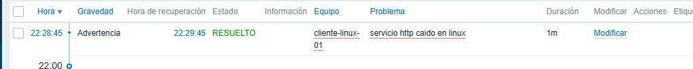
---

## 3.3. Escenario web para HTTP


Esto es más “profesional” que solo comprobar el puerto.

Ve a:

```text
Recopilación de datos → Equipos → cliente-linux-01 → Web → Crear escenario web
```

Configura:

```text
Nombre: Web cliente (linux o windows)
Intervalo de actualización: 1m
Intentos: 1
Agente: Zabbix
```
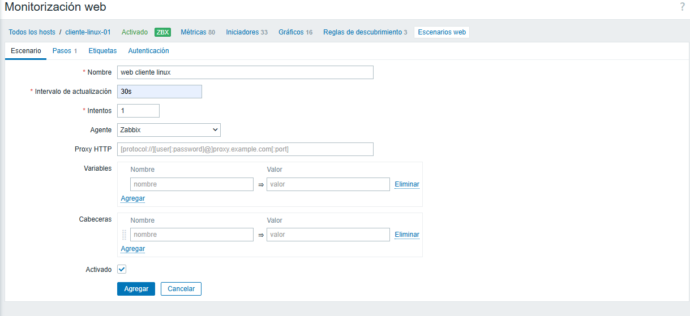
Añade un paso:

```text
Nombre: pagina
URL: http://192.168.1.20
Códigos de estado requeridos: 200
```
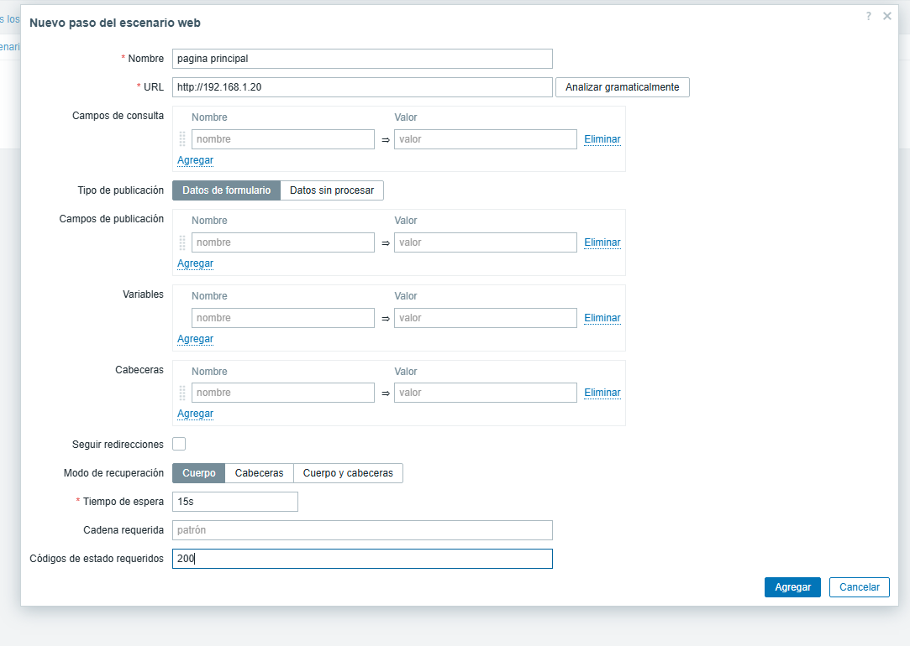
Guarda.

---

## Qué datos genera

En Zabbix:

```text
Monitorización → Equipos → cliente-linux-01 → Web
```
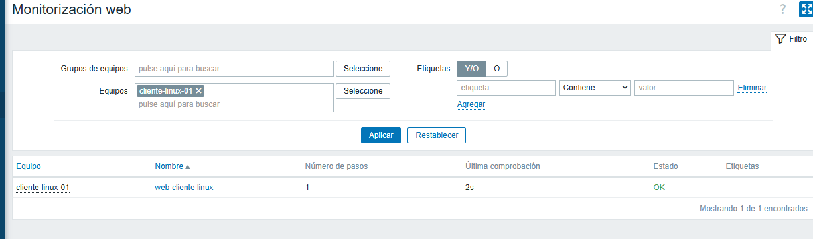

---

## Iniciador para escenario web

Puedes crear un iniciador con la métrica de escenario web. El nombre exacto de la métrica puede variar, así que hazlo desde el selector de expresiones.

Ruta:

dentro del iniciador en expresiones

Busca una métrica relacionada con:

```text
Paso fallido del escenario "Web cliente Linux"
```

La expresión quedará parecida a:

```text
last(/cliente-linux-01/web.test.fail[web cliente linux])<>0
```
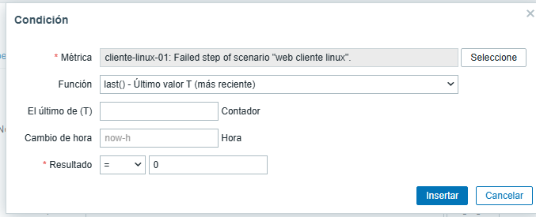

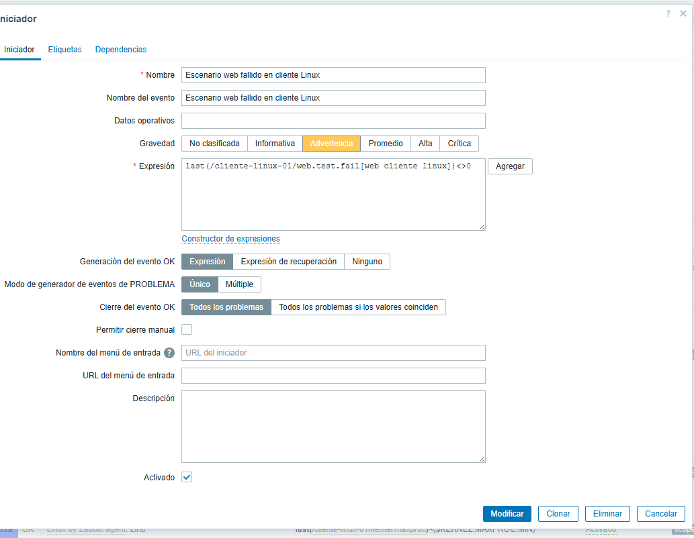
---

## Cómo comprobar el escenario web

En el cliente Linux:

paramos el servicio nginx  espera 1 minuto ve a:

```text
Monitorización → Equipos → cliente-linux-01 → Web
```


Deberías ver el escenario fallido.

inicia de nuevo el servicio y comprueba

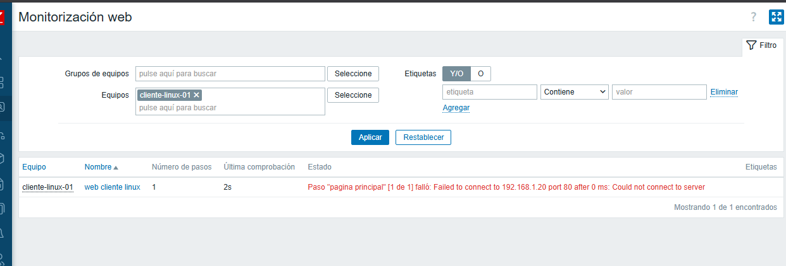

---

# 4. Monitorizar MariaDB

Aquí tienes dos niveles.

| Nivel    | Qué comprueba                       |
| -------- | ----------------------------------- |
| Básico   | Si el puerto MySQL/MariaDB responde |
| Avanzado | Métricas internas de MariaDB        |

Para empezar, usa el nivel básico. Luego, si quieres, metemos plantilla específica de MariaDB.

---

## 4.1. Comprobación básica del puerto MariaDB

MariaDB usa normalmente el puerto:

```text
3306
```

En el servidor Zabbix comprueba:

```bash
systemctl status mariadb
```

Comprueba si escucha:

```bash
ss -tulpn | grep ':3306'
```

Ojo: muchas instalaciones de MariaDB solo escuchan en `127.0.0.1`, y eso está bien si la base de datos está en el mismo servidor como en en nuestro caso.

---

## forma sencilla

Equipo:

```text
zabbix-server
```

metrica:

```text
Nombre: Servicio MariaDB disponible
Tipo: Comprobación sencilla
Clave: net.tcp.service[tcp,,3306]
Tipo de información: Numérico sin signo
Intervalo de actualización: 30s
```

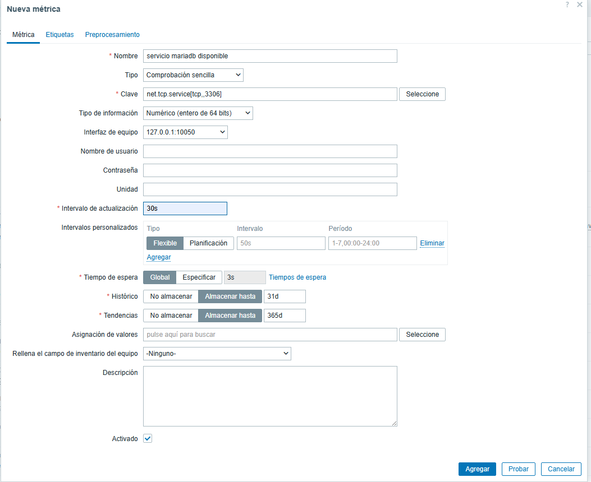

Uso `tcp,,3306` porque así compruebo directamente el puerto TCP 3306. En las comprobaciones simples de Zabbix se puede indicar servicio, IP y puerto; cuando se usa `tcp`, el puerto es obligatorio. ([zabbix.com][1])

---

## Iniciador

```text
Nombre: MariaDB caída en servidor Zabbix
Gravedad: Alta
Expresión:
last(/zabbix-server/net.tcp.service[tcp,,3306])=0
```
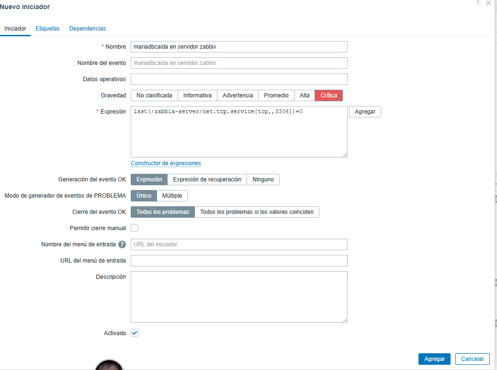

---

## provocar fallo

paramos el servicio.

Importante: esto puede afectar al propio Zabbix porque Zabbix depende de MariaDB. Para una prueba rápida vale, pero no lo dejes parado mucho tiempo lo normal seria que la base estuviera en otra maquina pero en mi caso como es un proyecto para mostrar zabbix con esto me valdra.

iniciamos el servicio de nuevo

## captura de comprobacion

## hacer la segunda forma pero que la base este en otra maquina para mas profesionalidad (recordatorio para chatgpt y para mi)

---

# 5. Monitorizar el agente Zabbix

Esto sirve para saber si un equipo deja de enviar datos o si el agente está parado.

## En Linux

En Zabbix, revisa métrica:

```text
agent.ping
```
suele venir con la plantilla que le pusimos

---

## Iniciador recomendado

Si no existe ya, puedes crear:

```text
Nombre: Agente Zabbix no responde en cliente Linux
Gravedad: Promedio
Expresión:
nodata(/cliente-linux-01/agent.ping,5m)=1
```
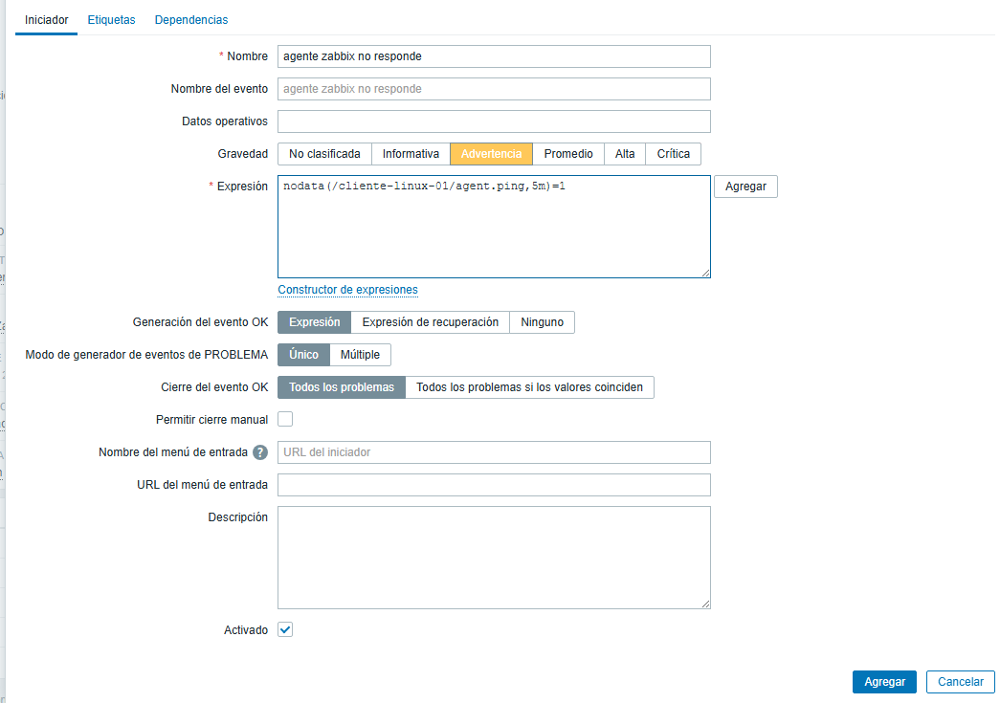

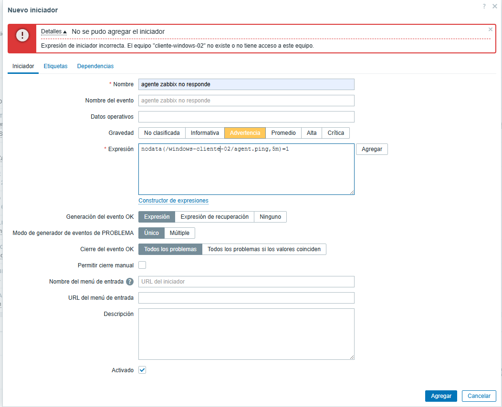
Esto significa: si no llegan datos de la métrica `agent.ping` durante 5 minutos, se activa.

---

## Cómo provocar fallo

En el cliente Linux:

```bash
sudo systemctl stop zabbix-agent2
```

Espera 5 minutos.

Resultado esperado:


recuerda iniciar de nnuevo el servicio
---

## En Windows

Pararlo:

```powershell
Stop-Service "Zabbix Agent 2"
```

Iniciarlo:

```powershell
Start-Service "Zabbix Agent 2"
```
Resultado correcto:

```text
1
```
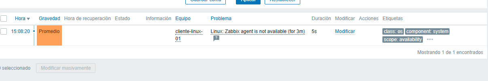
---

# 6. Monitorizar disco

Esto normalmente ya lo tienes con las plantillas:

```text
Linux by Zabbix agent
Windows by Zabbix agent
```

Pero conviene saber comprobarlo.

## Linux

En Zabbix:

```text
Monitorización → Datos más recientes → cliente-linux-01
```
utilizacion:
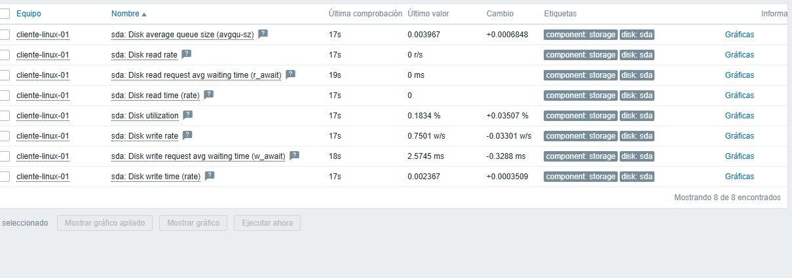

de manera visual:

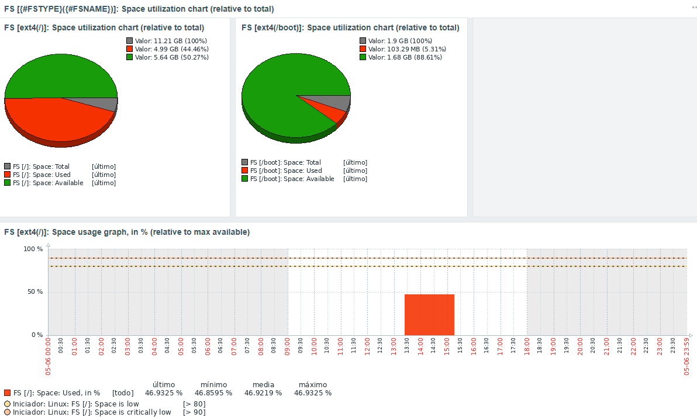

---

## Iniciador de disco

ya viene con la plantilla. pero si quieres uno personalizado por ejemplo:

```text
Nombre: Poco espacio libre en / del cliente Linux
Gravedad: Advertencia
Expresión: 
last(/cliente-linux-01/vfs.fs.dependent.size[/,pused])>90 ( esto "vfs.fs.dependent.size" cambia segun tu sistema asi que asegurate de buscar bien cual necesitas )
```

Esto se activa si queda menos del 10% libre en `/`.

---

## Cómo probarlo

En Linux puedes crear un archivo grande luego de comprobar borra:

```bash
df -h
fallocate -l 1G prueba_disco.img
df -h
```
No llenes el disco del todo. Hazlo con cuidado.

---

# 7. Monitorizar CPU

La CPU también viene con las plantillas.

## Comprobar en Linux

En Zabbix:

```text
Monitorización → Datos más recientes → cliente-linux-01
```

Busca:

```text
CPU utilization
Load average
```

---

## Instalar herramienta de prueba

En cliente Linux:

```bash
sudo apt install -y stress-ng
```

Generar carga:

```bash
stress-ng --cpu 2 --timeout 120s
```

En Zabbix mira:

```text
Monitorización → Equipos → cliente-linux-01 → Gráficos
```
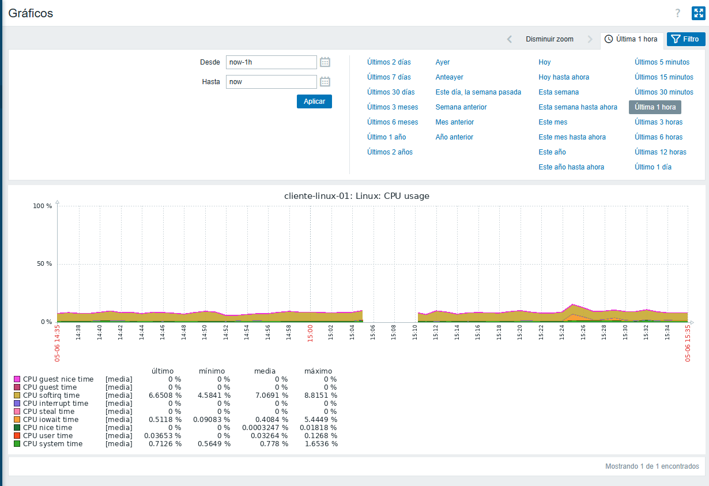

---

## Iniciador de CPU ejemplo

```text
Nombre: CPU alta en cliente Linux
Gravedad: Advertencia
Expresión:
avg(/cliente-linux-01/system.cpu.util[,user],5m)>80
```
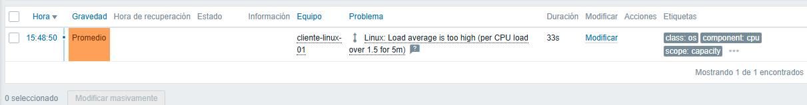

Esto se activaría si la CPU de usuario supera el 80% de media durante 5 minutos.

---

# 8. Monitorizar RAM

También suele venir por plantilla.

## Comprobar en Linux

En Zabbix:

```text
Monitorización → Datos más recientes
```

Busca:

```text
Memory utilization
Available memory
```

## Prueba sencilla

No te recomiendo forzar mucho la RAM porque puedes bloquear la VM.

Si quieres generar algo de carga controlada:

```bash
stress-ng --vm 1 --vm-bytes 512M --timeout 60s
```

---

# 9. Monitorizar servicios de Windows

Para Windows, lo básico ya vendrá por la plantilla:

```text
Windows by Zabbix agent
```

Puedes comprobar:

```text
CPU
RAM
Disco C:
Red
Uptime
Procesos
Servicios
```

## Comprobar disco C:
En Zabbix:

```text
Monitorización → Datos más recientes → windows-cliente-02
```

Busca:

```text
C: Space utilization
C: Free space
```

---

# 10. Resumen de comprobaciones

| Servicio       | Métrica Zabbix                  | Comprobación manual                                   | Prueba de fallo                                  |
| -------------- | ---------------------------- | ----------------------------------------------------- | ------------------------------------------------ |
| Ping           | `icmpping`                   | `ping IP`                                             | Apagar VM                                        |
| SSH            | `net.tcp.service[ssh]`       | `systemctl status ssh`, `nc -vz IP 22`                | `systemctl stop ssh`                             |
| HTTP puerto    | `net.tcp.service[http]`      | `curl http://IP`, `ss -tulpn \| grep :80`             | `systemctl stop nginx`                           |
| HTTP web       | `web.test.fail[...]`         | `curl -I http://IP`                                   | `systemctl stop nginx`                           |
| MariaDB        | `net.tcp.service[tcp,,3306]` | `systemctl status mariadb`, `ss -tulpn \| grep :3306` | `systemctl stop mariadb`                         |
| Agente Linux   | `agent.ping`                 | `zabbix_get -s IP -k agent.ping`                      | `systemctl stop zabbix-agent2`                   |
| Agente Windows | `agent.ping`                 | `Get-Service "Zabbix Agent 2"`                        | `Stop-Service "Zabbix Agent 2"`                  |
| Disco Linux    | `vfs.fs.size[/,pfree]`       | `df -h`                                               | `fallocate -l 1G archivo.img`                    |
| CPU Linux      | `system.cpu.util[...]`       | `top`, `uptime`                                       | `stress-ng --cpu 2 --timeout 120s`               |
| RAM Linux      | `vm.memory.size[...]`        | `free -h`                                             | `stress-ng --vm 1 --vm-bytes 512M --timeout 60s` |

---


# Fuentes utilizadas

* Zabbix: tipos de métrica con agente y uso de Zabbix Agent / Agent 2. ([zabbix.com][4])
* Zabbix: comprobaciones simples y uso de `net.tcp.service[]`. ([zabbix.com][1])
* Zabbix: monitorización web mediante escenario webs. ([zabbix.com][3])
* Zabbix: expresiones de iniciadores. ([zabbix.com][2])

[1]: https://www.zabbix.com/documentation/current/en/manual/config/métricas/métricatypes/simple_checks?utm_source=chatgpt.com "5 Simple checks"
[2]: https://www.zabbix.com/documentation/current/en/manual/config/iniciadores/expression?utm_source=chatgpt.com "2 Iniciador expression"
[3]: https://www.zabbix.com/documentation/current/en/manual/web_monitoring?utm_source=chatgpt.com "9 Web monitoring"
[4]: https://www.zabbix.com/documentation/current/en/manual/config/métricas/métricatypes/zabbix_agent?utm_source=chatgpt.com "1 Zabbix agent"
