# seguridad del servidor 

aqui mejoraremos la seguridad del entorno del proyecto tanto del servidor como de los clientes


## 1. seguridad del servidor zabbix

### 1.1. Cambio de contraseña de Admin

empezaremos cambiando la contraseña de admin

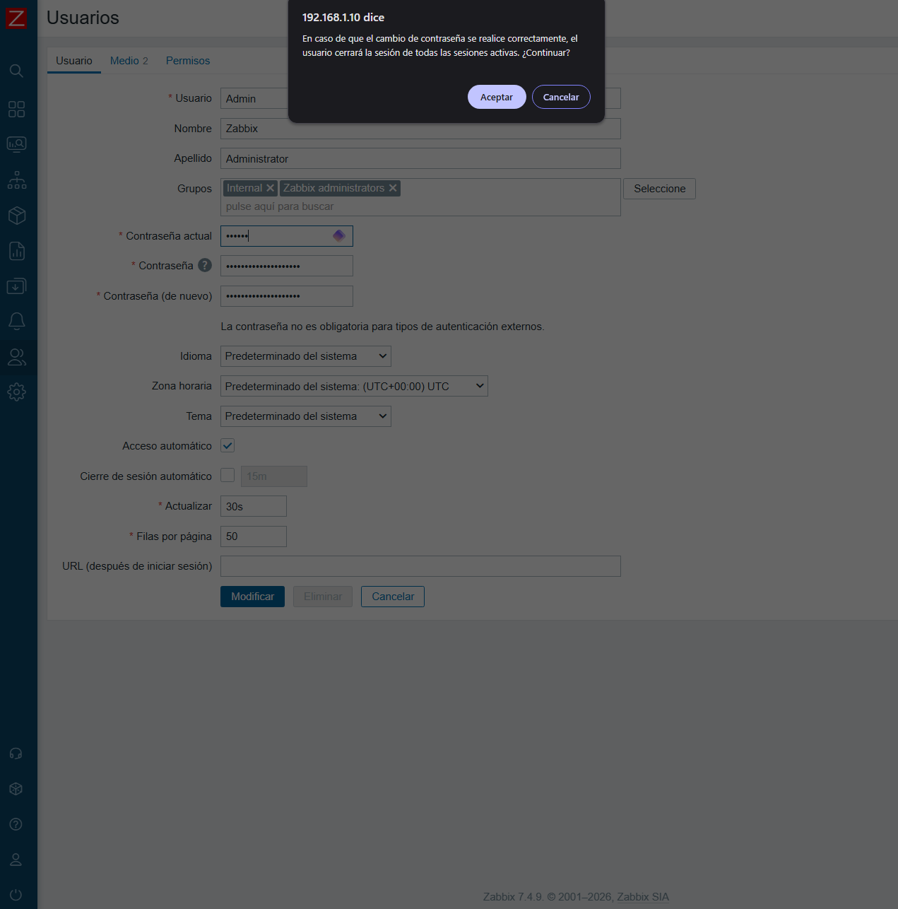

Tras el primer acceso al frontend de Zabbix se cambió la contraseña por defecto del usuario Admin. Esta medida evita mantener credenciales conocidas públicamente y reduce el riesgo de acceso no autorizado.

### 1.2. Revisión del usuario guest
ademas debemos mirar si el usuario guest no tiene privilegios de admin que no deberia pero mejor revisar y asi confirmamos

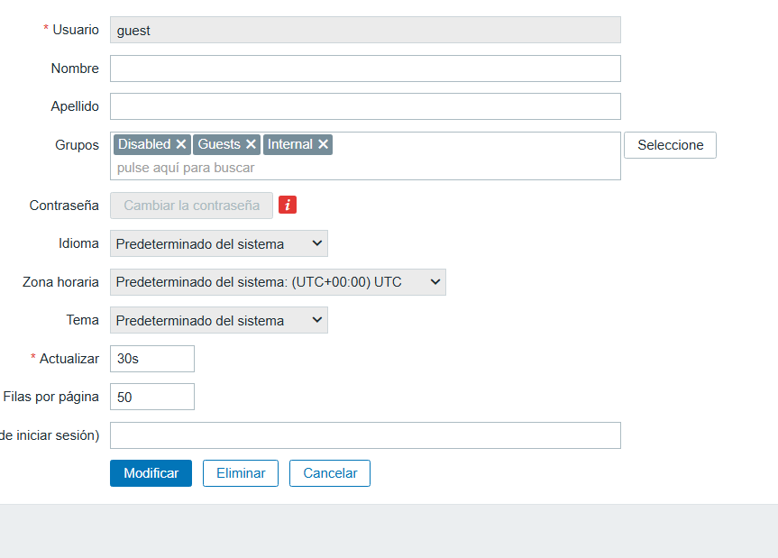

podemos ver que de por si esta deshabilitada lo dejamos asi y seguimos

### 1.3. Creación de usuario administrador propio

ahora crearemos un usuario nuevo para nosotros para no usar la cuenta generica de admin 

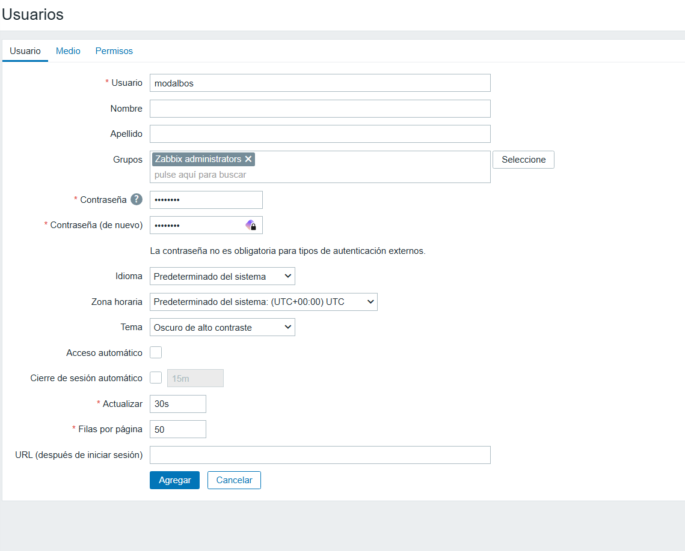

el nombre le ponemos el que queramos yo dejare vacio los apellidos y el nombre 

lo metere en el grupo administradores para poder tocar zabbix al completo a usuarios invitados o que no sean administradores les debemos poner un tiempo limitado para que se le cierre la sesion automaticamente


y en roles le damos el de super admin

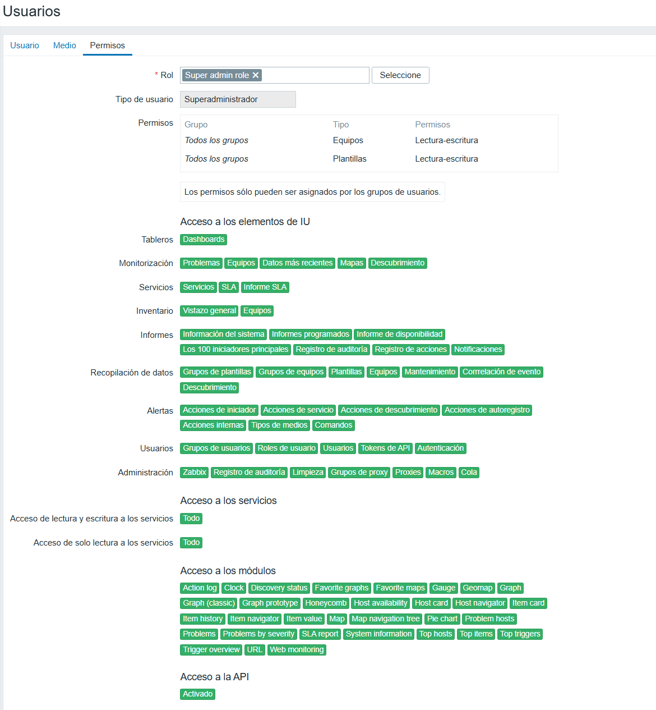

## 2. seguridad del firewall

 ### 2.1. Firewall del servidor
ya deberiamos tener esta configuracion en el firewall

|    Puerto | Servicio      | Motivo                                                      | estado  |
| --------: | ------------- | ----------------------------------------------------------- |-------- |
|    22/tcp | SSH           | Administración remota                                       | activo  |
|    80/tcp | HTTP          | Acceso web a Zabbix                                         | activo  |
| 10051/tcp | Zabbix Server | Comunicación con agentes activos                            | activo  |
|   443/tcp | HTTPS         | Se abrirá al configurar HTTPS                               | apagado |
| 10050/tcp | Zabbix Agent  | Solo necesario en clientes o si se consulta el agente local | activo  |

activaremos el que falta 

```bash
ufw allow 443/tcp
ufw reload
ufw status
```


Configuramos UFW para permitir únicamente los puertos necesarios: SSH para administración, HTTP/HTTPS para acceso al frontend y el puerto 10051/TCP para comunicación con Zabbix Server. El resto de conexiones entrantes quedan bloqueadas por defecto.

### 2.2. Firewall de los clientes

En los clientes se permite únicamente el puerto 10050/TCP para que el servidor Zabbix pueda consultar el agente pero tambien puedes permitir el de ssh para administracion remota. En Windows se añadió una regla específica al Firewall de Windows.

windows:
```powershell
New-NetFirewallRule -DisplayName "Zabbix Agent 2" -Direction Inbound -Protocol TCP -LocalPort 10050 -Action Allow
```
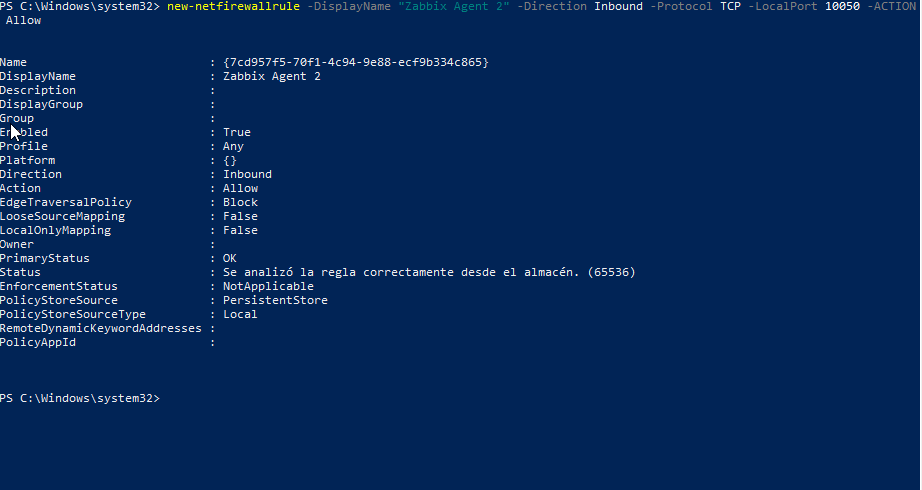

ubuntu server:
```bash
sudo ufw allow 10050/tcp
sudo ufw status
```
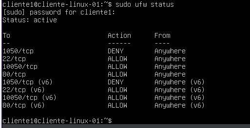


## 3. Copias de seguridad de zabbix

### 3.1. Backup manual
creamos las carpetas para las copias de seguridad
```bash
mkdir -p /root/backups/zabbix
```
y para mas facilidad creamos variables de fecha y de la ruta 
```bash
FECHA=$(date +%F_%H-%M)
BACKUP_DIR="/root/backups/zabbix/$FECHA"
mkdir -p "$BACKUP_DIR"
```
creamos la copia con la herramienta que tiene mariadb
```bash
mariadb-dump --single-transaction --quick --routines --triggers zabbix > "$BACKUP_DIR/zabbix_db.sql"
```
comprobamos que se hizo


```bash
tar -czvf "$BACKUP_DIR/zabbix_config.tar.gz" \
/etc/zabbix \
/etc/nginx \
/etc/php \
/etc/apt/sources.list \
/etc/apt/sources.list.d \
/usr/lib/zabbix/alertscripts \
/usr/lib/zabbix/externalscripts 2>/dev/null
```
con el anterior comando acabamos de guardar la onfiguracion de lo siguiente

Zabbix
Nginx
PHP
Repositorios
Scripts de alertas
Scripts externos

podemos ver que la copia se hizo

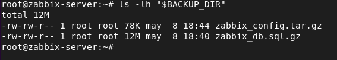

es necesario hacer una copia de vez en cuando por si ocurre algun problema y tambien en caso de cambiar de servidor poder trasladar la base de datos y las configuraciones de manera sencilla 

### 3.2. Script de backup
con este script lo tienes automatizado

```bash
#!/bin/bash

set -e

FECHA=$(date +%F_%H-%M)
DESTINO="/root/backups/zabbix/$FECHA"

mkdir -p "$DESTINO"

mariadb-dump --single-transaction --quick --routines --triggers zabbix | gzip > "$DESTINO/zabbix_db.sql.gz"

tar -czvf "$DESTINO/zabbix_config.tar.gz" \
/etc/zabbix \
/etc/nginx \
/etc/php \
/etc/apt/sources.list \
/etc/apt/sources.list.d \
/usr/lib/zabbix/alertscripts \
/usr/lib/zabbix/externalscripts 2>/dev/null

echo "Backup completado correctamente: $FECHA"
ls -lh "$DESTINO"
```

set -e hace que el script se detenga si algún comando falla. De esta forma evita mostrar un mensaje de backup correcto cuando realmente se ha producido un error.

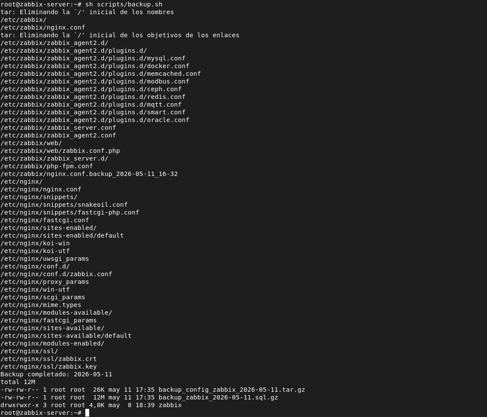

### 3.3. Restauración

```bash
mariadb zabbix < backup_zabbix_2026-05-11.sql
```
Importa el contenido del archivo .sql dentro de la base de datos zabbix.
< envía el archivo como entrada al comando mariadb.

y si esta comprimido
```bash
gunzip -c backup_zabbix_2026-05-11.sql.gz | mariadb zabbix
```

la configuraciones
```bash
tar -xzvf backup_config_zabbix_2026-05-11.tar.gz -C /
```
y reiniciamos
```bash
systemctl restart zabbix-server zabbix-agent2 nginx php*-fpm
```
podemos restaurarla con estos comandos


## 4. seguridad de la web (https)

como no tenemos un dominio lo haremos con un certificado autofirmado

lo primero en caso de que algo nos salga mal debemos hacer una copia de los archivos de configuracion con la fecha del dia que lo modificaremos

comando:
```bash
cp /etc/zabbix/nginx.conf /etc/zabbix/nginx.conf.backup_$(date +%F_%H-%M)
```

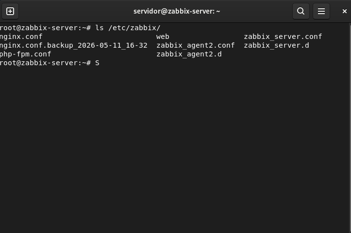

ya podemos empezar con el certificado

generamos el certificado
```bash
mkdir -p /etc/nginx/ssl

openssl req -x509 -nodes -days 365 -newkey rsa:2048 \
-keyout /etc/nginx/ssl/zabbix.key \
-out /etc/nginx/ssl/zabbix.crt

chmod 600 /etc/nginx/ssl/zabbix.key (para proteger la clave privada)
```
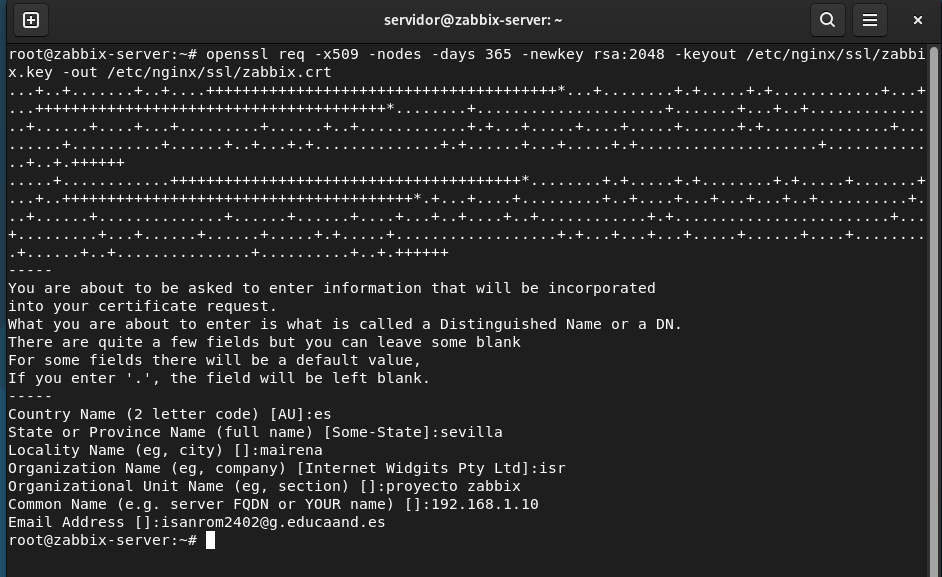

Country Name: tu_pais
State or Province Name: tu_provincia o estado
Locality Name: tu_localidad
Organization Name: tuorganizacion
Organizational Unit Name: el nombre que quieras
Common Name: la ip o el nombre con el que accedas a tu web de zabbix
Email Address: tu_correo

yo pongo mi ip por sencillez

protegemos la clave privada

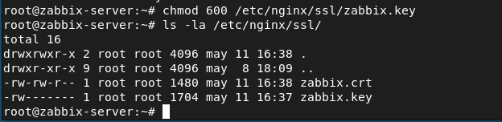

configuramos ahora los archivos de configuracion de nginx

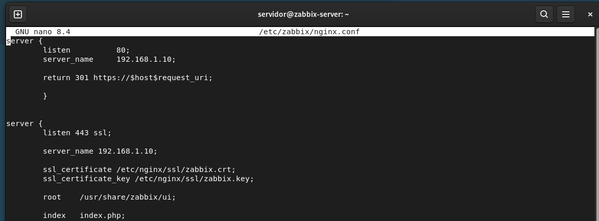

el puerto 443/tcp ya deberia estar abierto en el firewall


reiniciamos el servicio de nginx y entramos 


al entrar con https nos saldra esto

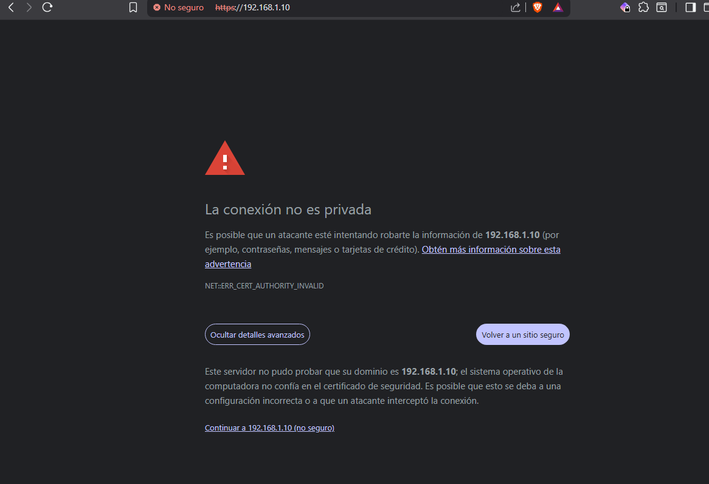

pero funciona

utilizó un certificado autofirmado para habilitar HTTPS en el frontend de Zabbix. Aunque el navegador muestra una advertencia al no estar emitido por una autoridad certificadora pública, la comunicación queda cifrada.

Como mejora futura se podría utilizar un dominio propio y Let's Encrypt, que permite obtener certificados válidos reconocidos por los navegadores. Los certificados habituales de Let's Encrypt tienen una validez de 90 días, por lo que se recomienda automatizar su renovación. En entornos empresariales también se podría usar una CA interna o corporativa.
--------

## 5. Cifrado agente-servidor con PSK

Esto es opcional.

Zabbix soporta cifrado TLS entre componentes usando certificados o claves precompartidas PSK.

Para tu proyecto lo puedes dejar como mejora futura:

Como mejora de seguridad adicional, se podría configurar cifrado PSK entre el servidor Zabbix y los agentes, protegiendo la comunicación de monitorización.

------

## 6. comandos utiles de diagnostico
```bash
journalctl -u zabbix-server -f
journalctl -u nginx -f
journalctl -u mariadb -f
journalctl -u zabbix-agent2 -f
tail -f /var/log/zabbix/zabbix_server.log

ss -tulpn

ufw status verbose

```
## 7. resumen de lo hecho

| Medida               | Aplicación en el proyecto                                 |
| -------------------- | --------------------------------------------------------- |
| Cambio de contraseña | Se cambió la contraseña por defecto del usuario Admin     |
| Control de usuarios  | Se revisó el usuario guest y se usó usuario administrador |
| Firewall             | UFW activo con puertos mínimos                            |
| HTTPS                | Certificado autofirmado en laboratorio                    |
| Actualizaciones      | Sistema actualizado con `apt`                             |
| Backups              | Copia de base de datos y configuración                    |
| Logs                 | Revisión con `journalctl` y logs de Zabbix                |
